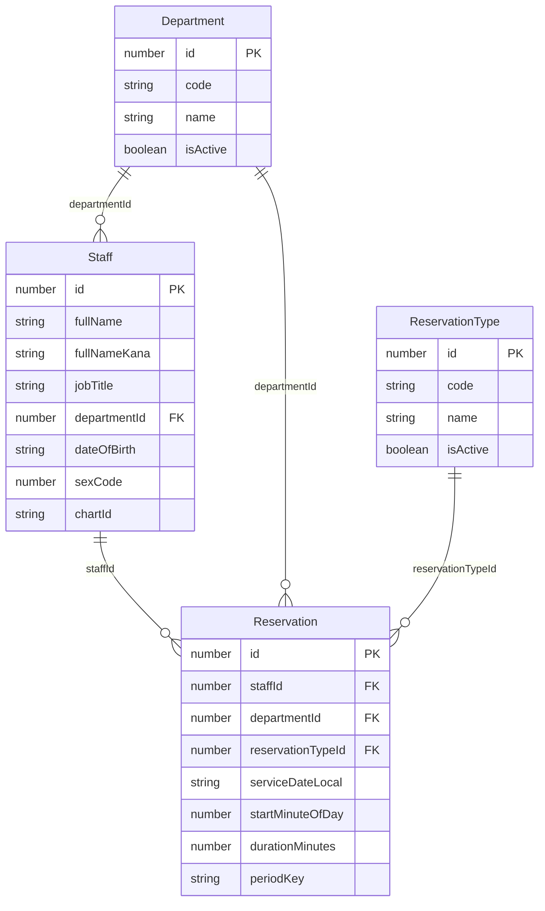

# data-specification.md

最終更新: 2025-11-01 (Asia/Tokyo)

---

## 1. 背景と目的

- **対象**: 職員向け予約（例：インフルワクチン、職員健診 など）。
- **目的**: 命名規約・データモデル・制約（年度ごとの 1 回制限、時間重複の禁止）を明文化し、実装と運用の再現性を担保する。
- **方針**:
  - 主キー: `id`、外部キー: `xxxId`（一貫命名）。
  - 時間は**1440 分方式**（日付＋分）で保存。必要時のみ API で UTC に変換して返却。
  - 「年度 1 回」は**グローバル規則**（境界=毎年 4/1）で制御し、DB の一意制約で保証。

---

## 2. 命名規約 / 型ポリシー

- **命名**: JSON/TS は `camelCase`、DB はチーム慣習に合わせる（`snake_case` も可）。
- **主キー**: `id:number`。
- **外部キー**: `xxxId:number`（例: `staffId`, `departmentId`, `reservationTypeId`）。
- **日付**: 文字列 `YYYY-MM-DD`（タイムゾーンなし・ローカル日付）。
- **性**: `sexCode:number`（ISO 5218: `0=不明, 1=男性, 2=女性, 9=適用不能`）。
- **カルテID**: 文字列（先頭ゼロ/英数混在に備える）。

---

## 3. エンティティ定義

### 3.1 Staff（職員）

| フィールド   | 型                 | 必須 | 説明                             |
| ------------ | ------------------ | ---- | -------------------------------- |
| id           | number             | ✅   | 主キー                           |
| fullName     | string             | ✅   | 氏名                             |
| fullNameKana | string             | ✅   | シメイ（カナ）                   |
| jobTitle     | string             | ✅   | 職種（自由入力、将来マスタ化可） |
| departmentId | number             | ✅   | 部署参照                         |
| dateOfBirth  | string(YYYY-MM-DD) | ✅   | 生年月日（ローカル日付）         |
| sexCode      | number             | ✅   | ISO 5218（0/1/2/9）              |
| chartId      | number             | ✅   | カルテID（EMR 側キー）           |
| staffId      | number             | ✅   | 職員ID          |

### 3.2 Department（部署）

| フィールド | 型      | 必須 | 説明                             |
| ---------- | ------- | ---- | -------------------------------- |
| id         | number  | ✅   | 主キー                           |
| code       | string  | ✅   | 部署コード（人可読な短いコード） |
| name       | string  | ✅   | 部署名                           |
| isActive   | boolean | ✅   | 運用中フラグ                     |

### 3.3 ReservationType（予約種別）

> **軽量マスタ**として運用（対象期間などの周期ポリシーは持たせない。全種別がグローバル規則で同一運用）

| フィールド | 型      | 必須 | 説明                               |
| ---------- | ------- | ---- | ---------------------------------- |
| id         | number  | ✅   | 主キー                             |
| code       | string  | ✅   | 例: `FLU_VACCINE`, `STAFF_CHECKUP` |
| name       | string  | ✅   | 表示名                             |
| isActive   | boolean | ✅   | 運用中フラグ                       |

### 3.4 Reservation（予約）

> **1440 分方式**：ローカル日付 + 分で保存。UTC は必要時のみ API で導出。

| フィールド        | 型                 | 必須 | 説明                                                       |
| ----------------- | ------------------ | ---- | ---------------------------------------------------------- |
| id                | number             | ✅   | 予約ナンバー（主キー）                                     |
| staffId           | number             | ✅   | 職員 ID（Staff 参照）                                      |
| departmentId      | number             | ✅   | 部署 ID（Department 参照）                                 |
| reservationTypeId | number             | ✅   | 予約種別 ID（ReservationType 参照）                        |
| serviceDateLocal  | string(YYYY-MM-DD) | ✅   | 予約日                |
| startMinuteOfDay  | number(0..1439)    | ✅   | 予約時刻 00:00 からの分オフセット                              |
| durationMinutes   | number(>0)         | ✅   | 予約時間（分）                                             |
| periodKey         | string             | ✅   | 年度キー（例: `FY2025`）。生成列または保存のいずれかに統一 |

---

## 4. 年度キー（periodKey）仕様

- **年度境界**: 毎年 **4/1** 開始、翌年 **3/31** 終了。
- **算出ルール**:
  - `serviceDateLocal` の月が **4〜12** → `FY = year`。
  - 月が **1〜3** → `FY = year - 1`。
  - **periodKey** DB生成列（STORED）／4月1日始まり年度／型: integer／入力不可・出力のみ

---

## 5. 制約設計

- **年度 1 回制限（DB レベル保証）**
  - 一意制約: `UNIQUE (staffId, reservationTypeId, periodKey)`
  - 効果: 同一職員が同一予約種別を同一年度に**1 回のみ**予約可能。

- **時間帯重複の禁止（業務制約）**
  - 同一 `(staffId, serviceDateLocal)` において、`[start, end)` 区間が**重ならない**こと。
  - 端点一致（`end == start`）を許容。

---

## 6. バリデーション要件（アプリ側）

- `serviceDateLocal`: 形式 `YYYY-MM-DD` ＋ 妥当日付（うるう年等）。
- `startMinuteOfDay`: `0..1439`。
- `durationMinutes`: `> 0`（必要なら上限も設定）。
- `sexCode`: `in [0,1,2,9]`（ISO 5218）。
- 参照整合性: `departmentId`, `reservationTypeId` は実在必須。
- `chartId`: 必須、院内ルールの桁/文字種に適合。

---

## 7. API I/O 方針（UTC の扱い）

- **DB 保存**は `serviceDateLocal + startMinuteOfDay + durationMinutes` を**唯一の真実**とする（UTC は保存しない）。
- **API 出力**で UTC が必要な場合:
  - `startAtUTC`, `endAtUTC` を都度導出して返却（ISO 8601 / `Z` 付き）。
  - ラウンドトリップ（ローカル→UTC→ローカル）で恒等となることをユニットテストで担保。

---

## 8. ER 図（概念）

---

## 9. 代表ユースケース / テスト観点

- **FY 判定**
  - `2026-03-31 → FY2025`、`2026-04-01 → FY2026`。

- **年度 1 回制限**
  - `UNIQUE (staffId, reservationTypeId, periodKey)` により FY 内 2 件目は拒否。

- **時間重複**
  - 同一 `staffId`・同一日で 09:00–09:30 と 09:15–09:45 は重複→拒否。
  - 09:00–09:30 と 09:30–10:00 は端点一致→許容（本書初期案）。

---

## 10. 将来拡張

- 予約種別ごとの周期差が必要になった場合、`ReservationType` に周期ポリシー（例: `periodPolicy`, `limitPerPeriod`, `periodAnchorMonth`）を**後付け**で追加可能。
- 職員以外（患者）も同モデルで扱う必要が出た場合、参加者を一般化（例: `participantType`, `participantId`）して拡張。

---

## 11. 付録：用語

- **1440 分方式**: ローカル日付と「日内の分」で時刻を表現する保存方式（`serviceDateLocal + startMinuteOfDay + durationMinutes`）。
- **FY（Fiscal Year）**: 本書では 4/1 開始–翌 3/31 終了の年度。
- **periodKey**: 年度一意のキー。例: `FY2025`。

---
