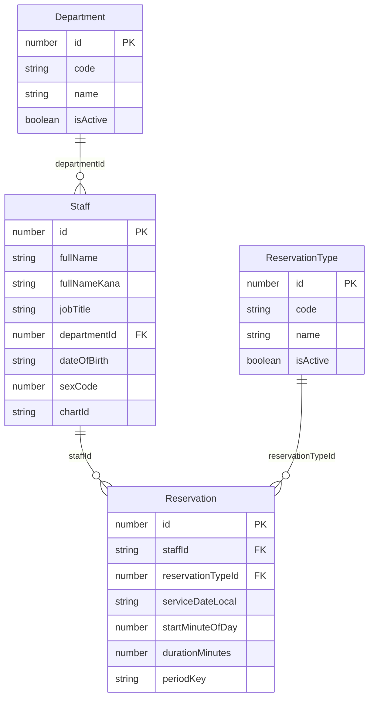

# data-specification.md（改訂版）

最終更新: 2025-11-01 (Asia/Tokyo)

---

## 1. 背景と目的

- **対象**: 職員向け予約（例：インフルワクチン、職員健診 など）
- **目的**: 命名規約・データモデル・制約（年度ごとの 1 回制限、時間重複の禁止）を明文化し、実装と運用の再現性を担保
- **方針**:
  - 主キー: `id`、外部キー: `xxxId`（一貫命名）
  - **保存の唯一の真実**は「1440 分方式」＝ `serviceDateLocal (YYYY-MM-DD)` + `startMinuteOfDay (0..1439)` + `durationMinutes (>0)`
  - 「年度 1 回」は**グローバル規則**（境界=毎年 4/1）で、DB の **一意制約**で保証
  - **DTOは最小限**（予約成立に必要な値のみ）。プロフィール等はマスタ（Staff）に集約

---

## 2. 命名規約 / 型ポリシー

- **命名**: JSON/TS は `camelCase`、DB はプロジェクト慣習に合わせる（`snake_case` でも可）
- **主キー**: `id: number`
- **外部キー**: `xxxId` 原則 `number`（例: `reservationTypeId`）※ `staffId` は Staff 主キーに合わせ `string`
- **日付**: 文字列 `YYYY-MM-DD`（ローカル日付、タイムゾーン情報は持たない）
- **性 (Sex)**: `sexCode: number`（ISO 5218: `0=不明, 1=男性, 2=女性, 9=適用不能`）
- **カルテID**: `chartId: string`（先頭ゼロ・英数混在に備えて文字列）
- **periodKey**: `string`（例: `FY2025`）※DB生成列 or サービス層で算出→保存のどちらかに統一。**入力で受け取らない**

---

## 3. エンティティ定義

### 3.1 Staff（職員）

| フィールド   | 型                 | 必須 | 説明                             |
| ------------ | ------------------ | ---- | -------------------------------- |
| id           | string             | ✅   | 主キー                           |
| fullName     | string             | ✅   | 氏名                             |
| fullNameKana | string             | ✅   | シメイ（カナ）                   |
| jobTitle     | string             | ✅   | 職種（自由入力、将来マスタ化可） |
| departmentId | number             | ✅   | 部署参照（Department FK）        |
| dateOfBirth  | string(YYYY-MM-DD) | ✅   | 生年月日（ローカル日付）         |
| sexCode      | number             | ✅   | ISO 5218（0/1/2/9）              |
| chartId      | string             | ✅   | カルテID（EMR側キー）            |

> 備考: `staffId` はフィールド名として不要（= 主キー `id` が職員ID）

### 3.2 Department（部署）

| フィールド | 型      | 必須 | 説明                             |
| ---------- | ------- | ---- | -------------------------------- |
| id         | number  | ✅   | 主キー                           |
| code       | string  | ✅   | 部署コード（人可読な短いコード） |
| name       | string  | ✅   | 部署名                           |
| isActive   | boolean | ✅   | 運用中フラグ                     |

### 3.3 ReservationType（予約種別）

> **軽量マスタ**として運用（対象期間などの周期ポリシーは持たせない。すべてグローバル規則に従う）

| フィールド | 型      | 必須 | 説明                               |
| ---------- | ------- | ---- | ---------------------------------- |
| id         | number  | ✅   | 主キー                             |
| code       | string  | ✅   | 例: `FLU_VACCINE`, `STAFF_CHECKUP` |
| name       | string  | ✅   | 表示名                             |
| isActive   | boolean | ✅   | 運用中フラグ                       |

### 3.4 Reservation（予約）

> **1440 分方式**：ローカル日付 + 分で保存。UTC は必要時のみ API で導出。

| フィールド        | 型                 | 必須 | 説明                                                                |
| ----------------- | ------------------ | ---- | ------------------------------------------------------------------- |
| id                | number             | ✅   | 予約ナンバー（主キー）                                              |
| staffId           | string             | ✅   | 職員 ID（Staff 参照）                                               |
| reservationTypeId | number             | ✅   | 予約種別 ID（ReservationType 参照）                                 |
| serviceDateLocal  | string(YYYY-MM-DD) | ✅   | 予約日（ローカル日付、妥当日付のみ）                                |
| startMinuteOfDay  | number(0..1439)    | ✅   | 当日 00:00 からの分オフセット                                       |
| durationMinutes   | number(>0)         | ✅   | 予約時間（分）                                                      |
| periodKey         | string             | ✅   | 年度キー（例: `FY2025`）。**入力不可**（DB生成列 or Serviceで算出） |

> **設計注**: `departmentId` は **Reservation には保持しない**（Staff 経由で参照）。
> 業務要件で「当時の部署名を固定化」といった**スナップショット**が必要な場合のみ、
> 予約側に `snapshotDepartmentId` / `snapshotDepartmentName` 等を**非FK**として後付けする。

---

## 4. 年度キー（periodKey）仕様

- **年度境界**: 毎年 **4/1** 開始、翌年 **3/31** 終了
- **算出ルール**（`serviceDateLocal` を使用）:
  - 月が **4〜12** → `FY = year`
  - 月が **1〜3** → `FY = year - 1`
  - `periodKey = 'FY' + FY`（例: `2026-03-31 → FY2025`, `2026-04-01 → FY2026`）

- **実装方針**:
  - A) **DB 生成列**（推奨：STORED generated column）
  - B) **Service で算出して保存**（今回MVPでも可）
  - いずれか **1つに統一**し、API入力では受け取らない

---

## 5. 制約設計

- **年度 1 回制限（DB レベル保証）**
  - 一意制約: `UNIQUE (staffId, reservationTypeId, periodKey)`
  - 効果: 同一職員が同一予約種別を同一年度に **1 回のみ**予約可能

- **時間帯重複の禁止（業務制約 / Service 層）**
  - 同一 `(staffId, serviceDateLocal)` において、半開区間 `[start, end)` が**重ならない**こと
  - 端点一致（`end == start`）は許容

> 将来、粒度（例: 30分刻み）を固定する場合は、`startMinuteOfDay` と `durationMinutes` の倍数制約を **Service層**で検証（またはDBチェック制約）

---

## 6. バリデーション要件（アプリ側）

- `serviceDateLocal`: 形式 `YYYY-MM-DD` **かつ実在日付**（うるう年含む）
- `startMinuteOfDay`: `0..1439`
- `durationMinutes`: `> 0`（必要なら上限も設定）
- `staffId`: 非空文字列、`reservationTypeId`: 正の整数。いずれも**実在FK**であること（存在確認）
- `sexCode`（Staff）: `in [0,1,2,9]`
- **DTOは最小限**（予約作成は `serviceDateLocal`, `startMinuteOfDay`, `durationMinutes`, `staffId`, `reservationTypeId` のみ）。`periodKey` は受け取らない

---

## 7. API I/O 方針（UTC の扱い）

- **保存**は「1440分方式」のみ（UTC は保存しない）
- **出力**でUTCが必要な場合：
  - `startAtUTC`, `endAtUTC` を都度導出（ISO 8601 / `Z` 付き）
  - ローカル↔UTC のラウンドトリップで恒等となることをユニットテストで担保

---

## 8. ER 図（概念）

> 注: `Reservation` は部署FKを持たない（必要ならスナップショット項目を後付け）

---

## 9. 代表ユースケース / テスト観点

- **FY 判定**
  - `2026-03-31 → FY2025`、`2026-04-01 → FY2026`

- **年度 1 回制限**
  - 同一 `staffId` + `reservationTypeId` + `periodKey` の2件目で **DBレベル**の一意制約エラー

- **時間重複**
  - 同一 `staffId`・同一日で 09:00–09:30 と 09:15–09:45 は重複→拒否
  - 09:00–09:30 と 09:30–10:00 は端点一致→許容

- **DTO/バリデーション**
  - `2025-13-40` など実在しない日付→ 400
  - `startMinuteOfDay=1440` / `durationMinutes=0` → 400
  - `periodKey` を送っても無視（`forbidNonWhitelisted: true` の場合は 400）

---

## 10. 管理アクセス（MVP想定）

- **APIの責務外**だが運用上の最小線として明記：
  - 管理UI: `/admin`（ServeStatic）
  - 管理API: `/api/admin/*`
  - **アプリ層**: `X-Admin-Token === ADMIN_TOKEN`（env）でガード
  - **プロキシ層**: Basic認証＋IP許可（可能なら）で二重ロック
  - 監査ログ: `who / what / when` の最小記録（stdoutで可）

---

## 11. 将来拡張

- **周期差**が必要なら ReservationType に `periodPolicy`, `limitPerPeriod`, `periodAnchorMonth` 等を追加
- **参加者の一般化**（職員以外を扱う場合）: `participantType`, `participantId` で抽象化
- **部署スナップショット**が必要になった時のみ、予約側に `snapshotDepartmentId/name` を非FKで追加

---

## 12. 用語

- **1440 分方式**: `serviceDateLocal + startMinuteOfDay + durationMinutes` により、時刻をローカル日付と日内分で表す保存方式
- **FY（Fiscal Year）**: 4/1 開始–翌 3/31 終了の年度
- **periodKey**: 年度一意キー。`'FY' + 年度` 形式（例: `FY2025`）。**入力不可**
