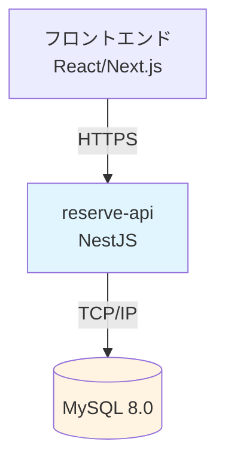
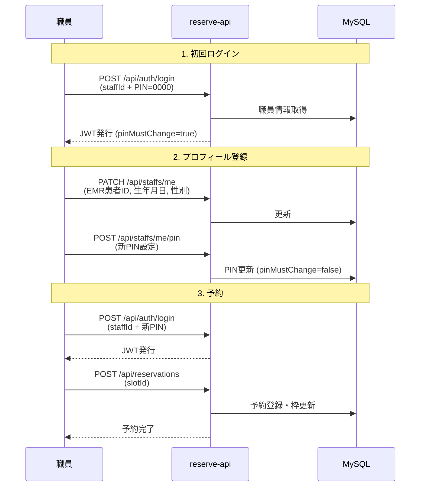

# 01. システム概要

## 1.1 システム名称

**予約管理システム API (reserve-api)**

---

## 1.2 目的

医療機関における職員向け予防接種・健診等の予約を管理するバックエンドAPIシステム。

### 主な目的
- 職員の予約業務をデジタル化し、紙ベースの運用を廃止
- 予約枠の定員管理を自動化し、オーバーブッキングを防止
- 年度ごとの予約回数制限により、適切なリソース配分を実現

---

## 1.3 システム概要（3行要約）

1. **職員が自身でログイン・予約**：PIN認証により本人確認を行い、公開された予約枠から選択
2. **年度1回制限・定員管理**：同一年度・同一種別は1回のみ予約可能、枠の定員に達したら予約不可
3. **管理者によるCSV一括登録**：職員情報をCSVで一括登録、予約枠をWeb UIで管理

---

## 1.4 主要機能

### 1.4.1 職員向け機能
- **認証・ログイン**：職員ID + 4桁PINによる認証
- **プロフィール管理**：初回ログイン時にEMR患者ID・生年月日・性別を登録
- **PIN変更**：初回ログイン時に強制変更、その後任意で変更可能
- **予約登録**：公開された予約枠から選択して予約

### 1.4.2 管理者向け機能
- **職員一括登録**：CSV形式で職員情報をインポート
- **予約種別管理**：予防接種・健診等の種別を登録
- **予約枠管理**：日時・定員・受付期間を指定して枠を作成

### 1.4.3 セキュリティ機能
- **JWT認証**：アクセストークン（15分）+ リフレッシュトークン（30日）
- **PINロック**：5回連続失敗で手動解除が必要になるまでロック
- **トークンローテーション**：リフレッシュ時に新しいトークンを発行、古いトークン無効化
- **トークン再利用検知**：古いトークン再利用を検知し、全セッション失効

---

## 1.5 システム構成

### 構成要素
| 要素 | 技術 | 役割 |
|------|------|------|
| **API** | NestJS + TypeScript | ビジネスロジック・認証・データ操作 |
| **データベース** | MySQL 8.0 | 職員・予約・枠情報の永続化 |
| **認証** | JWT (jsonwebtoken) | ステートレスな認証 |
| **パスワードハッシュ** | argon2 | PIN安全な保管 |

---

## 1.6 対象ユーザー

### 1.6.1 職員（STAFF ロール）
- **対象**：病院で働く全職員（医師・看護師・技師・事務職等）
- **利用シーン**：予防接種・健診の予約
- **人数規模**：数百〜数千人

### 1.6.2 管理者（ADMIN ロール）
- **対象**：人事部・総務部の担当者
- **利用シーン**：職員登録・予約枠設定
- **人数規模**：数人〜十数人

---

## 1.7 利用フロー

---

## 1.8 用語集

| 用語 | 英語 | 説明 |
|------|------|------|
| **職員** | Staff | システム利用者。病院で働く全職員 |
| **職員ID** | Staff ID | 本部から発行される数字のみのID（例: 900100） |
| **PIN** | Personal Identification Number | 4桁の数字による認証情報 |
| **EMR患者ID** | EMR Patient ID | 電子カルテシステムの患者ID |
| **予約種別** | Reservation Type | 予防接種・健診等の種類 |
| **予約枠** | Reservation Slot | 特定の日時・定員を持つ予約受付枠 |
| **年度** | Fiscal Year (FY) | 日本の会計年度（4/1〜3/31） |
| **期間キー** | Period Key | 年度を識別する文字列（例: FY2025） |
| **定員** | Capacity | 1つの枠で受け付ける最大予約数 |
| **受付期間** | Booking Window | 予約可能な期間（開始日時〜終了日時） |
| **リフレッシュトークン** | Refresh Token | アクセストークン再発行用の長期トークン |
| **トークンローテーション** | Token Rotation | リフレッシュ時に新トークン発行・旧トークン無効化 |
| **べき等性** | Idempotency | 同じ操作を複数回実行しても結果が同じ |
| **楽観ロック** | Optimistic Locking | versionカラムで更新競合を検知 |
| **ペッパー** | Pepper | ハッシュ化時にすべてのPINに追加する秘密の値 |

---

## 1.9 システム制約

### 1.9.1 機能制約
- 同一年度・同一種別の予約は **1回のみ**
- 予約のキャンセル機能は **未実装**（管理者による手動対応）
- 予約の変更機能は **未実装**（キャンセル→再予約で対応）

### 1.9.2 技術制約
- **データベース**：MySQL 8.0 以上
- **Node.js**：20.x 以上
- **タイムゾーン**：Asia/Tokyo 固定
- **文字コード**：UTF-8 (utf8mb4)

### 1.9.3 運用制約
- **PIN初期値**：全職員 `0000` で登録（初回ログイン時に強制変更）
- **PIN再発行**：管理者による手動リセット（API未実装）
- **バックアップ**：MySQL の mysqldump による日次バックアップ

---

## 1.10 非機能要件

| 項目 | 要件 | 実装方法 |
|------|------|---------|
| **可用性** | 99.9% (ダウンタイム月8.6時間以内) | Docker + ヘルスチェック |
| **パフォーマンス** | API応答時間 500ms 以内 | DB接続プール・インデックス |
| **セキュリティ** | OWASP Top 10 対策 | argon2・SQL injection対策 |
| **スケーラビリティ** | 同時接続 100 ユーザー | ステートレスAPI設計 |
| **保守性** | テストカバレッジ 80% 以上 | E2E・単体テスト |

---

## 1.11 関連ドキュメント

- **[02-Architecture.md](./02-Architecture.md)** - システムアーキテクチャ
- **[03-Data-Model.md](./03-Data-Model.md)** - データモデル
- **[05-API-Overview.md](./05-API-Overview.md)** - API仕様
- **[13-Business-Rules.md](./13-Business-Rules.md)** - 業務ルール

---

**最終更新**: 2025-11-03
**バージョン**: 1.0.0
