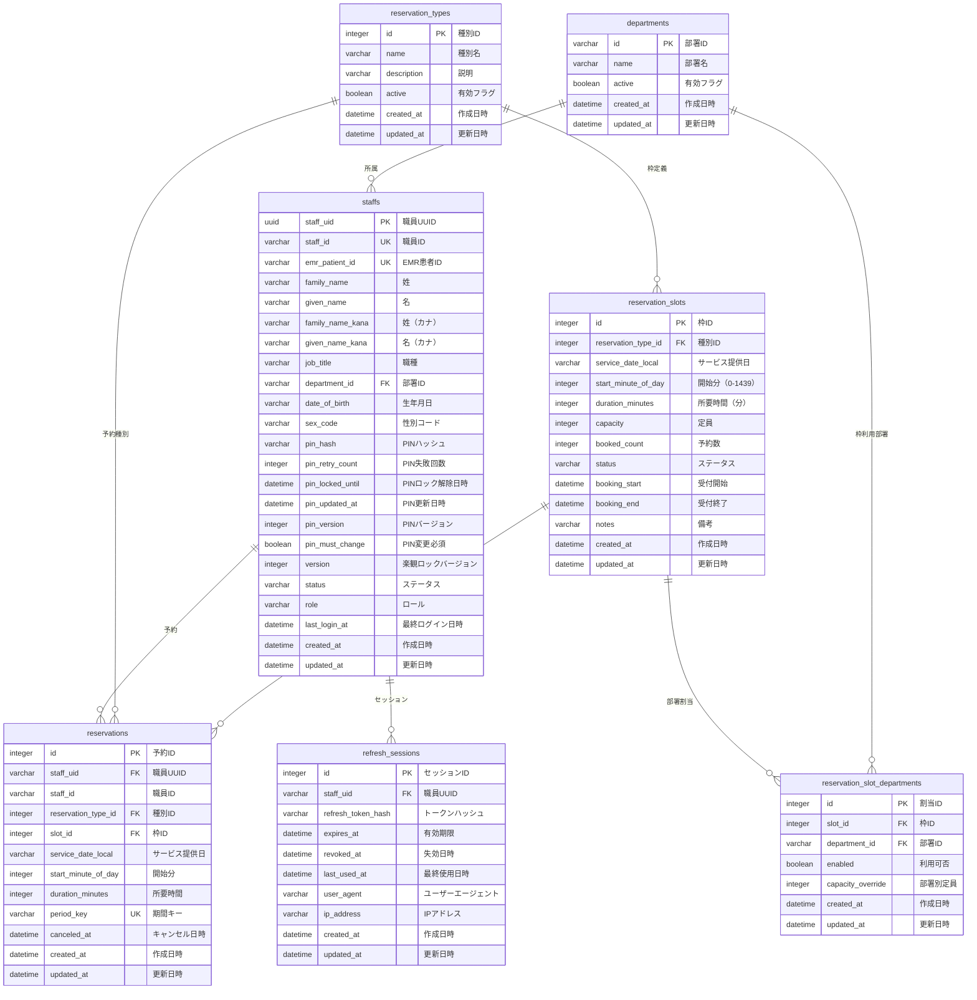

# 03. データモデル

## 3.1 ER図



---

## 3.2 テーブル一覧

| テーブル名 | 論理名 | 主な用途 |
|-----------|--------|---------|
| **departments** | 部署 | 職員の所属部署管理 |
| **staffs** | 職員 | 職員情報・認証情報 |
| **reservation_types** | 予約種別 | 予防接種・健診等の種類 |
| **reservation_slots** | 予約枠 | 日時・定員を持つ予約受付枠 |
| **reservation_slot_departments** | 予約枠部署割当 | 部署ごとの利用可否・定員を管理 |
| **reservations** | 予約 | 職員の予約記録 |
| **refresh_sessions** | リフレッシュセッション | JWTリフレッシュトークン管理 |

---

## 3.3 主要リレーション

### 3.3.1 部署 → 職員 (1:N)

```
departments (1) ----< (N) staffs
```

- 1つの部署に複数の職員が所属
- 外部キー: `staffs.department_id` → `departments.id`
- 削除制約: `ON DELETE RESTRICT`（所属職員がいる部署は削除不可）

---

### 3.3.2 職員 → 予約 (1:N)

```
staffs (1) ----< (N) reservations
```

- 1人の職員が複数の予約を持つ（ただし年度・種別ごとに1回のみ）
- 外部キー: `reservations.staff_uid` → `staffs.staff_uid`
- 削除制約: `ON DELETE RESTRICT`

---

### 3.3.3 予約種別 → 予約枠 (1:N)

```
reservation_types (1) ----< (N) reservation_slots
```

- 1つの予約種別に複数の枠が存在
- 外部キー: `reservation_slots.reservation_type_id` → `reservation_types.id`
- 削除制約: `ON DELETE RESTRICT`

---

### 3.3.4 予約枠 → 予約 (1:N)

```
reservation_slots (1) ----< (N) reservations
```

- 1つの枠に複数の予約が紐づく（定員まで）
- 外部キー: `reservations.slot_id` → `reservation_slots.id`
- 削除制約: `ON DELETE RESTRICT`

---

### 3.3.5 予約枠 ↔ 部署 (N:M)

```
reservation_slots (1) ----< (N) reservation_slot_departments (N) >---- (1) departments
```

- 部署割当が存在し、かつ `enabled=true` の場合のみ、その部署の職員はスロットを予約可能
- 外部キー: `reservation_slot_departments.slot_id` → `reservation_slots.id` (`ON DELETE CASCADE`)
- 外部キー: `reservation_slot_departments.department_id` → `departments.id` (`ON DELETE RESTRICT`)
- `capacity_override` が NULL の場合は枠の共通定員を採用、値が存在する場合は部署専用の定員を適用

---

### 3.3.6 職員 → リフレッシュセッション (1:N)

```
staffs (1) ----< (N) refresh_sessions
```

- 1人の職員が複数のセッションを持つ（複数デバイス対応）
- 外部キー: `refresh_sessions.staff_uid` → `staffs.staff_uid`
- 削除制約: `ON DELETE CASCADE`（職員削除時、セッションも削除）

---

## 3.4 主要なインデックス

### 3.4.1 職員テーブル

| インデックス名 | カラム | 種類 | 目的 |
|--------------|--------|------|------|
| `UQ_staffs_staff_id` | `staff_id` | UNIQUE | 職員ID重複防止 |
| `UQ_staffs_emr_patient_id` | `emr_patient_id` | UNIQUE | EMR患者ID重複防止 |
| `IDX_staffs_staff_id` | `staff_id` | INDEX | ログイン高速化 |
| `IDX_staffs_emr_patient_id` | `emr_patient_id` | INDEX | 検索高速化 |

---

### 3.4.2 予約テーブル

| インデックス名 | カラム | 種類 | 目的 |
|--------------|--------|------|------|
| `UQ_reservations_staff_type_period` | `(staff_id, reservation_type_id, period_key)` | UNIQUE | 年度1回制限 |
| `UQ_reservations_slot_staff` | `(slot_id, staff_id)` | UNIQUE | 同一枠重複防止 |
| `IDX_reservations_staff_uid` | `staff_uid` | INDEX | 職員の予約一覧取得 |

---

### 3.4.3 予約枠部署割当テーブル

| インデックス名 | カラム | 種類 | 目的 |
|--------------|--------|------|------|
| `UQ_reservation_slot_departments_slot_department` | `(slot_id, department_id)` | UNIQUE | 同一部署の重複割当防止 |
| `IDX_reservation_slot_departments_department` | `department_id` | INDEX | 部署別の検索 |

---

### 3.4.4 リフレッシュセッションテーブル

| インデックス名 | カラム | 種類 | 目的 |
|--------------|--------|------|------|
| `IDX_refresh_sessions_staff_uid` | `staff_uid` | INDEX | セッション検索高速化 |

---

## 3.5 データ型

### 3.5.1 文字列型

すべて `VARCHAR(255)` を使用（MySQL 8.0 互換性）。

| カラム例 | 型 | 理由 |
|---------|-----|------|
| `staff_id` | VARCHAR(255) | 数字のみだが文字列として扱う |
| `family_name` | VARCHAR(255) | 日本語対応（utf8mb4） |
| `pin_hash` | VARCHAR(255) | argon2 ハッシュ値 |

---

### 3.5.2 日時型

すべて `datetime` を使用（タイムゾーン: Asia/Tokyo）。

| カラム例 | 型 | 形式 |
|---------|-----|------|
| `created_at` | datetime | 2025-11-03 12:00:00 |
| `pin_locked_until` | datetime | 2025-11-03 12:30:00 |

---

### 3.5.3 UUID型

`VARCHAR(255)` として保存（TypeORM の `@PrimaryGeneratedColumn('uuid')` による）。

| カラム例 | 型 | 例 |
|---------|-----|-----|
| `staff_uid` | VARCHAR(255) | e742beb5-6957-4a7c-b9d2-6f5be4694618 |

---

## 3.6 正規化

### 第3正規形（3NF）を満たす設計

- **第1正規形**: すべてのカラムが原子値
- **第2正規形**: 部分関数従属性を排除
- **第3正規形**: 推移的関数従属性を排除

### 非正規化している箇所

| テーブル | カラム | 理由 |
|---------|--------|------|
| **reservations** | `staff_id` | `staff_uid` だけでなく `staff_id` も保存（検索高速化） |
| **reservations** | `service_date_local`, `start_minute_of_day`, `duration_minutes` | `slot` から複製（履歴保持） |

---

## 3.7 デフォルト値

### 3.7.1 職員テーブル

| カラム | デフォルト値 | 理由 |
|--------|------------|------|
| `date_of_birth` | 1900-01-01 | 初回登録時の仮値 |
| `sex_code` | 1 | 初回登録時の仮値 |
| `pin_retry_count` | 0 | ロック前の状態 |
| `pin_version` | 1 | 初期バージョン |
| `pin_must_change` | true | 初回ログイン時に変更必須 |
| `version` | 0 | 楽観ロックの初期値 |
| `status` | active | 有効な職員 |
| `role` | STAFF | 一般職員 |

---

### 3.7.2 予約枠テーブル

| カラム | デフォルト値 | 理由 |
|--------|------------|------|
| `booked_count` | 0 | 予約なしの状態 |
| `status` | draft | 管理者が公開するまで非公開 |

---

### 3.7.3 予約枠部署割当テーブル

| カラム | デフォルト値 | 理由 |
|--------|------------|------|
| `enabled` | true | 割当作成時は利用可能を前提 |

---

## 3.8 NULL許容

### 3.8.1 NULL不可のカラム

重要なビジネスルールに関わるカラムは NULL 不可。

| テーブル | カラム | 理由 |
|---------|--------|------|
| **staffs** | `staff_id`, `family_name`, `given_name`, `pin_hash` | 必須情報 |
| **reservations** | `staff_uid`, `slot_id`, `period_key` | 予約成立の必須条件 |

---

### 3.8.2 NULL許容のカラム

初回登録時や任意項目は NULL 許容。

| テーブル | カラム | 理由 |
|---------|--------|------|
| **staffs** | `emr_patient_id` | 初回登録時は未設定 |
| **staffs** | `family_name_kana`, `given_name_kana` | カナ情報は任意入力 |
| **staffs** | `pin_locked_until` | ロックされていない場合は NULL |
| **staffs** | `last_login_at` | まだログインしていない場合は NULL |
| **reservations** | `canceled_at` | キャンセルされていない場合は NULL |
| **refresh_sessions** | `revoked_at` | 失効していない場合は NULL |
| **reservation_slot_departments** | `capacity_override` | NULL の場合は枠共通定員を使用 |

---

## 3.9 文字コード・照合順序

### MySQL設定

```sql
-- データベース
CREATE DATABASE reserve_db
  CHARACTER SET utf8mb4
  COLLATE utf8mb4_unicode_ci;

-- テーブル（TypeORM が自動生成）
CREATE TABLE staffs (
  ...
) ENGINE=InnoDB DEFAULT CHARSET=utf8mb4 COLLATE=utf8mb4_unicode_ci;
```

---

## 3.10 トランザクション分離レベル

**READ COMMITTED** (MySQL デフォルト)

### 悲観的ロックの使用箇所

定員管理のため、予約枠の更新時に悲観的ロックを使用。

```typescript
const lockedSlot = await slotRepo.findOne({
  where: { id: slotId },
  lock: { mode: 'pessimistic_write' }  // FOR UPDATE
});
```

---

## 3.11 バックアップ対象

### 完全バックアップ（日次）

すべてのテーブルをバックアップ。

```bash
mysqldump -u reserve_user -p reserve_db > backup_$(date +%Y%m%d).sql
```

---

### 重要度別

| 重要度 | テーブル | 理由 |
|--------|---------|------|
| **高** | staffs, reservations | ビジネスデータ |
| **中** | reservation_types, reservation_slots | マスターデータ（再作成可能） |
| **低** | refresh_sessions | 一時データ（有効期限30日） |

---

## 3.12 関連ドキュメント

- **[04-Entity-Specifications.md](./04-Entity-Specifications.md)** - 各テーブルの詳細仕様
- **[13-Business-Rules.md](./13-Business-Rules.md)** - 業務ルール
- **[17-Operations.md](./17-Operations.md)** - バックアップ手順

---

**最終更新**: 2025-11-03
**バージョン**: 1.0.0
