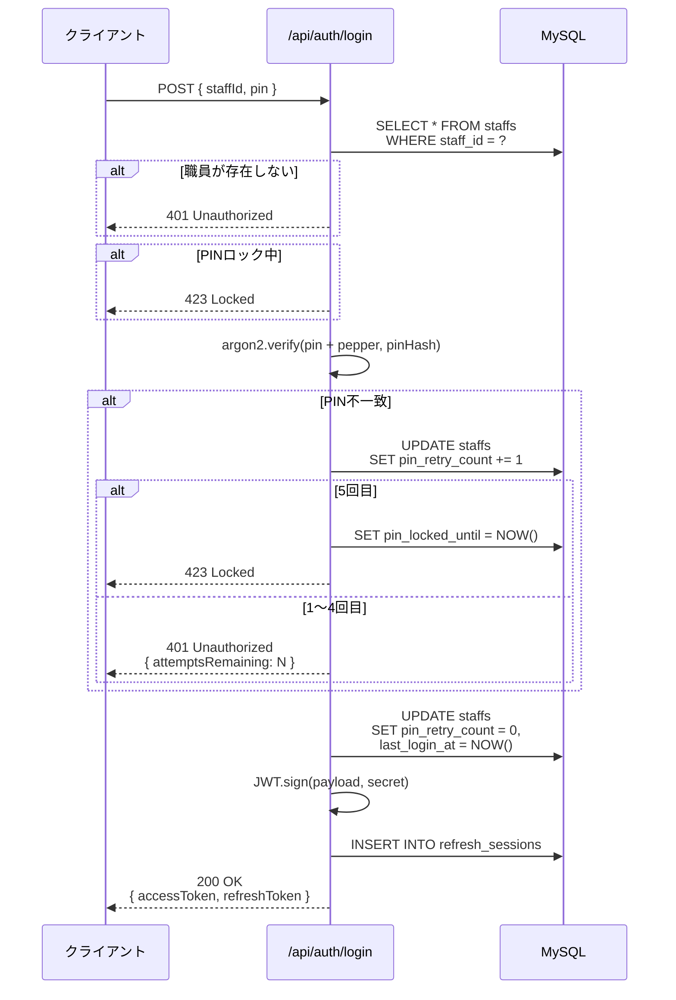
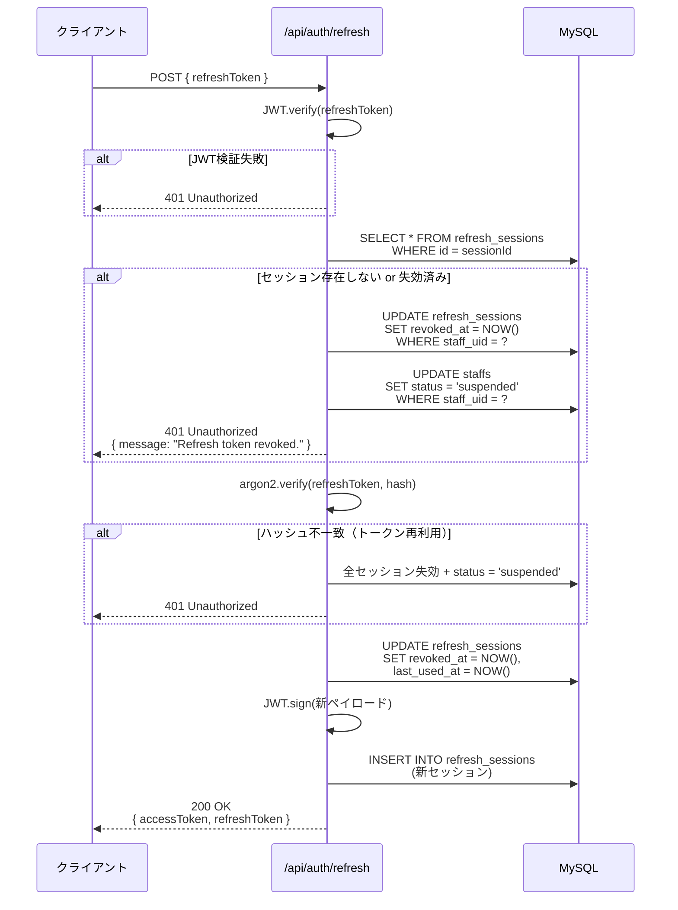

# 06. 認証API

## 6.1 概要

認証APIは職員のログインとトークンリフレッシュを提供します。

---

## 6.2 POST /api/auth/login

### 概要
職員ID + PINで認証し、JWTトークンを発行します。

### 認証
不要

### リクエスト

**Content-Type**: `application/json`

**Body**:
| フィールド | 型 | 必須 | 説明 | バリデーション |
|-----------|-----|------|------|--------------|
| `staffId` | string | ◯ | 職員ID | 数字のみ（例: `900100`） |
| `pin` | string | ◯ | 4桁PIN | 数字4桁（例: `1234`） |

**例**:
```json
{
  "staffId": "900100",
  "pin": "0000"
}
```

---

### レスポンス

#### 成功 (200 OK)

```json
{
  "tokenType": "Bearer",
  "accessToken": "eyJhbGciOiJIUzI1NiIsInR5cCI6IkpXVCJ9...",
  "refreshToken": "eyJhbGciOiJIUzI1NiIsInR5cCI6IkpXVCJ9...",
  "expiresIn": 900
}
```

| フィールド | 型 | 説明 |
|-----------|-----|------|
| `tokenType` | string | 常に `Bearer` |
| `accessToken` | string | アクセストークン（15分有効） |
| `refreshToken` | string | リフレッシュトークン（30日有効） |
| `expiresIn` | number | アクセストークンの有効期間（秒） |

---

#### エラー

**400 Bad Request** - バリデーションエラー
```json
{
  "statusCode": 400,
  "message": [
    "staffId must match /^\\d+$/ regular expression",
    "pin must match /^\\d{4}$/ regular expression"
  ],
  "error": "Bad Request"
}
```

**401 Unauthorized** - 認証失敗（1〜4回目）
```json
{
  "statusCode": 401,
  "message": "invalid credentials",
  "attemptsRemaining": 3
}
```

| フィールド | 型 | 説明 |
|-----------|-----|------|
| `message` | string | エラーメッセージ |
| `attemptsRemaining` | number | 残りログイン試行回数（0になるとロック） |

**401 Unauthorized** - アカウント停止
```json
{
  "statusCode": 401,
  "message": "Account revoked due to security incident."
}
```

**423 Locked** - PINロック中（5回目以降）
```json
{
  "statusCode": 423,
  "message": "PIN locked due to repeated failures.",
  "retryAfter": "2025-11-03T12:00:00.000Z"
}
```

| フィールド | 型 | 説明 |
|-----------|-----|------|
| `retryAfter` | string | ロック解除日時（ISO 8601形式） |

---

### ビジネスルール

#### PIN検証
1. 職員IDでスタッフを検索
2. 職員が存在しない場合 → 401
3. `status` が `active` でない場合 → 401
4. `pinLockedUntil` が設定されている場合 → 423
5. PIN検証（argon2 + pepper）
6. 不一致の場合：
   - `pinRetryCount` をインクリメント
   - 5回目で `pinLockedUntil` を現在時刻に設定 → 423
   - 1〜4回目 → 401 + `attemptsRemaining`
7. 一致の場合：
   - `pinRetryCount` をリセット
   - `lastLoginAt` を更新
   - JWT発行

#### トークン発行
- **アクセストークン**: 15分有効（`JWT_EXPIRES_IN=900s`）
- **リフレッシュトークン**: 30日有効（`REFRESH_EXPIRES_IN=30d`）
- **User-Agent**: リクエストヘッダーから記録
- **IP Address**: リクエス元IPを記録

---

### シーケンス図



---

### アクセストークンのペイロード

```json
{
  "sub": "e742beb5-6957-4a7c-b9d2-6f5be4694618",
  "sid": "900100",
  "role": "STAFF",
  "status": "active",
  "iat": 1699001234,
  "exp": 1699002134
}
```

| フィールド | 説明 |
|-----------|------|
| `sub` | 職員UUID（`staff_uid`） |
| `sid` | 職員ID（`staff_id`） |
| `role` | ロール（`STAFF` または `ADMIN`） |
| `status` | ステータス（`active` / `suspended` / `left`） |
| `iat` | 発行日時（UNIX timestamp） |
| `exp` | 有効期限（UNIX timestamp） |

---

### 使用例

```bash
curl -X POST http://localhost:3000/api/auth/login \
  -H "Content-Type: application/json" \
  -d '{
    "staffId": "900100",
    "pin": "0000"
  }'
```

---

## 6.3 POST /api/auth/refresh

### 概要
リフレッシュトークンを使用して新しいアクセストークンを取得します。

### 認証
不要（リフレッシュトークンをBodyに含める）

### リクエスト

**Content-Type**: `application/json`

**Body**:
| フィールド | 型 | 必須 | 説明 |
|-----------|-----|------|------|
| `refreshToken` | string | ◯ | リフレッシュトークン |

**例**:
```json
{
  "refreshToken": "eyJhbGciOiJIUzI1NiIsInR5cCI6IkpXVCJ9..."
}
```

---

### レスポンス

#### 成功 (200 OK)

```json
{
  "tokenType": "Bearer",
  "accessToken": "eyJhbGciOiJIUzI1NiIsInR5cCI6IkpXVCJ9...",
  "refreshToken": "eyJhbGciOiJIUzI1NiIsInR5cCI6IkpXVCJ9...",
  "expiresIn": 900
}
```

**重要**: リフレッシュトークンは **ローテーション** されます。
- 古いリフレッシュトークンは無効化（`revoked_at` が設定される）
- 新しいリフレッシュトークンが発行される

---

#### エラー

**400 Bad Request** - バリデーションエラー
```json
{
  "statusCode": 400,
  "message": [
    "refreshToken must be a string"
  ],
  "error": "Bad Request"
}
```

**401 Unauthorized** - トークン無効
```json
{
  "statusCode": 401,
  "message": "Refresh token invalid."
}
```

**401 Unauthorized** - トークン失効済み
```json
{
  "statusCode": 401,
  "message": "Refresh token revoked."
}
```

---

### ビジネスルール

#### トークンローテーション
1. リフレッシュトークンをJWT検証
2. ペイロードから `sessionId` を取得
3. DB から該当セッションを検索
4. セッションが存在しない、または `revoked_at` が設定済み → 401
5. トークンハッシュを検証（argon2）
6. 不一致の場合 → 401 + **トークン再利用検知**
7. 一致の場合：
   - 古いセッションを失効（`revoked_at` を現在時刻に）
   - 新しいアクセストークンとリフレッシュトークンを発行

#### トークン再利用検知
古いリフレッシュトークンが再利用された場合：
1. 該当職員の **全セッション** を失効
2. 職員のステータスを `suspended` に変更
3. 次回ログイン時に 401 を返す

**目的**: リフレッシュトークンの盗難・漏洩を検知し、被害を最小化。

---

### シーケンス図



---

### リフレッシュトークンのペイロード

```json
{
  "sub": "e742beb5-6957-4a7c-b9d2-6f5be4694618",
  "sid": "900100",
  "sessionId": 5,
  "iat": 1699001234,
  "exp": 1701593234
}
```

| フィールド | 説明 |
|-----------|------|
| `sub` | 職員UUID |
| `sid` | 職員ID |
| `sessionId` | セッションID（`refresh_sessions.id`） |
| `iat` | 発行日時 |
| `exp` | 有効期限（30日後） |

---

### 使用例

```bash
curl -X POST http://localhost:3000/api/auth/refresh \
  -H "Content-Type: application/json" \
  -d '{
    "refreshToken": "eyJhbGciOiJIUzI1NiIsInR5cCI6IkpXVCJ9..."
  }'
```

---

## 6.4 環境変数

| 変数名 | デフォルト値 | 説明 |
|--------|------------|------|
| `JWT_SECRET` | `change-me` | アクセストークンの署名鍵 |
| `JWT_EXPIRES_IN` | `900s` | アクセストークンの有効期限 |
| `REFRESH_SECRET` | `change-refresh` | リフレッシュトークンの署名鍵 |
| `REFRESH_EXPIRES_IN` | `30d` | リフレッシュトークンの有効期限 |
| `REFRESH_ROTATE` | `true` | リフレッシュトークンのローテーション有効化 |
| `SECURITY_PIN_PEPPER` | (base64) | PINハッシュ化用ペッパー |

---

## 6.5 セキュリティ考慮事項

### PINハッシュ化
```typescript
// ハッシュ生成
const pinHash = await argon2.hash(pin + pepper, {
  type: argon2.argon2id,
  timeCost: 3,
  memoryCost: 64 * 1024,
  parallelism: 1
});

// 検証
const isValid = await argon2.verify(pin + pepper, pinHash);
```

**パラメータ**:
- **アルゴリズム**: argon2id（ハイブリッド）
- **timeCost**: 3（計算コスト）
- **memoryCost**: 64MB
- **parallelism**: 1（並列度）

---

### トークン再利用検知の重要性

**シナリオ**:
1. 攻撃者がリフレッシュトークンを盗む
2. 正規ユーザーがリフレッシュ → 新トークン発行、旧トークン失効
3. 攻撃者が旧トークンでリフレッシュ試行
4. **システムが検知** → 全セッション失効 + アカウント停止

**効果**: トークン漏洩に気づいた時点で即座に対応できる。

---

## 6.6 関連ドキュメント

- **[05-API-Overview.md](./05-API-Overview.md)** - API共通仕様
- **[10-Authentication.md](./10-Authentication.md)** - 認証フロー詳細
- **[12-Security.md](./12-Security.md)** - セキュリティ要件

---

**最終更新**: 2025-11-03
**バージョン**: 1.0.0
