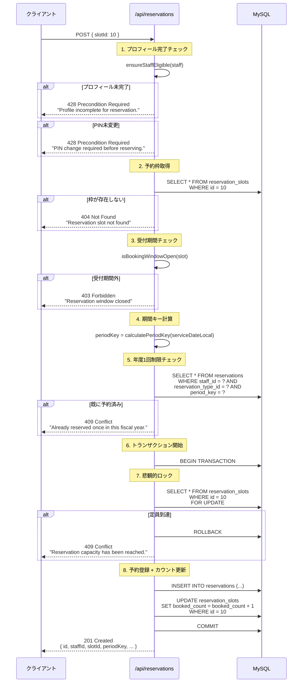
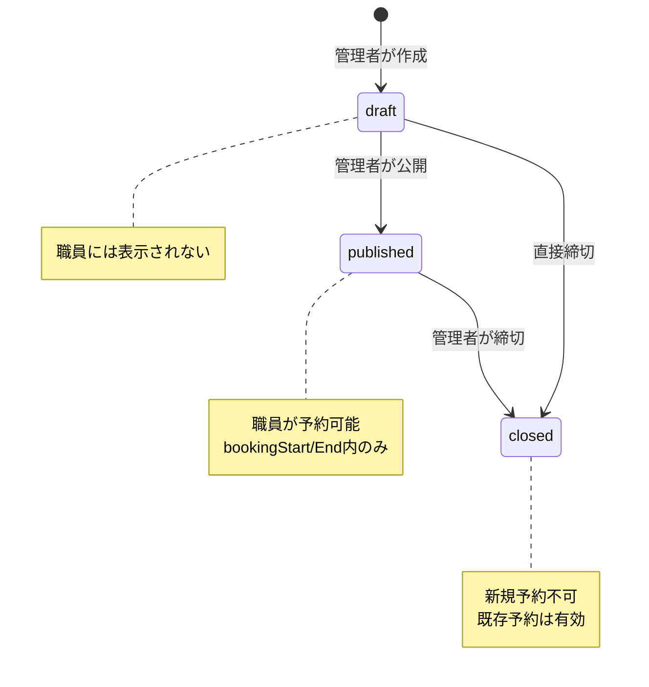

# 08. 予約API

## 8.1 概要

予約APIは、職員が予約枠を選択して予約を登録する機能を提供します。また、特定の予約種別・期間での予約状況を確認する機能も提供します。

---

## 8.2 GET /api/reservations/check

### 概要
指定した予約種別と期間において、現在のユーザーが既に予約を持っているかを確認します。フロントエンドで予約詳細画面と新規予約画面の出し分けに使用します。

### 認証
必須（JWT Bearer認証）

### リクエスト

**Headers**:
```http
Authorization: Bearer <access_token>
```

**Query Parameters**:
| パラメータ | 型 | 必須 | 説明 | バリデーション |
|-----------|-----|------|------|---------------|
| `reservationTypeId` | number | ◯ | 予約種別ID | 1以上の整数 |
| `periodKey` | string | ◯ | 期間キー（例: `FY2025`） | 文字列（空でない） |

**例**:
```http
GET /api/reservations/check?reservationTypeId=1&periodKey=FY2025
```

---

### レスポンス

#### 成功 (200 OK)

**予約が存在しない場合**:
```json
{
  "exists": false
}
```

**予約が存在する場合**:
```json
{
  "exists": true,
  "reservation": {
    "id": 123,
    "staffUid": "e742beb5-6957-4a7c-b9d2-6f5be4694618",
    "staffId": "900100",
    "reservationTypeId": 1,
    "slotId": 10,
    "serviceDateLocal": "2025-05-01",
    "startMinuteOfDay": 540,
    "durationMinutes": 30,
    "periodKey": "FY2025",
    "canceledAt": null,
    "createdAt": "2025-11-03T10:00:00.000Z",
    "updatedAt": "2025-11-03T10:00:00.000Z",
    "reservationType": {
      "id": 1,
      "name": "インフルエンザ予防接種",
      "description": null,
      "active": true
    },
    "slot": {
      "id": 10,
      "reservationTypeId": 1,
      "serviceDateLocal": "2025-05-01",
      "startMinuteOfDay": 540,
      "durationMinutes": 30,
      "capacity": 10,
      "bookedCount": 5,
      "status": "published"
    }
  }
}
```

| フィールド | 型 | 説明 |
|-----------|-----|------|
| `exists` | boolean | 予約が存在する場合は `true`、存在しない場合は `false` |
| `reservation` | object \| undefined | 予約が存在する場合のみ含まれる予約詳細 |

---

#### エラー

**400 Bad Request** - バリデーションエラー
```json
{
  "statusCode": 400,
  "message": [
    "reservationTypeId must be an integer number",
    "reservationTypeId must not be less than 1"
  ],
  "error": "Bad Request"
}
```

**401 Unauthorized** - 認証エラー
```json
{
  "statusCode": 401,
  "message": "Unauthorized"
}
```

**404 Not Found** - スタッフが見つからない
```json
{
  "statusCode": 404,
  "message": "Staff not found"
}
```

---

### 使用例

```bash
# 予約存在チェック
curl -X GET "http://localhost:3000/api/reservations/check?reservationTypeId=1&periodKey=FY2025" \
  -H "Authorization: Bearer <token>"
```

### フロントエンドでの活用例

```typescript
// 予約状況を確認して適切な画面に遷移
const response = await fetch(
  `/api/reservations/check?reservationTypeId=1&periodKey=FY2025`,
  { headers: { Authorization: `Bearer ${token}` } }
);

const { exists, reservation } = await response.json();

if (exists) {
  // 既に予約済み → 詳細画面へ
  router.push(`/reservations/${reservation.id}`);
} else {
  // 未予約 → 新規予約画面へ
  router.push(`/reservations/new?typeId=1`);
}
```

---

### 注意事項

- キャンセル済みの予約（`canceledAt` が `null` でない）は「存在しない」として扱われます
- 同一ユーザーが同一の予約種別・期間で複数の予約を持つことはビジネスルール上不可能です
- `periodKey` は日本の年度基準（4月開始）で計算されます（詳細は 8.4.3 参照）

---

## 8.3 POST /api/reservations

### 概要
指定した予約枠に対して予約を登録します。

### 認証
必須（JWT Bearer認証）

### リクエスト

**Headers**:
```http
Authorization: Bearer <access_token>
Content-Type: application/json
```

**Body**:
| フィールド | 型 | 必須 | 説明 | バリデーション |
|-----------|-----|------|------|---------------|
| `slotId` | number | ◯ | 予約枠ID | 1以上の整数 |

**例**:
```json
{
  "slotId": 10
}
```

---

### レスポンス

#### 成功 (201 Created)

```json
{
  "id": 123,
  "staffUid": "e742beb5-6957-4a7c-b9d2-6f5be4694618",
  "staffId": "900100",
  "reservationTypeId": 1,
  "slotId": 10,
  "serviceDateLocal": "2025-12-15",
  "startMinuteOfDay": 540,
  "durationMinutes": 30,
  "periodKey": "FY2025",
  "canceledAt": null,
  "createdAt": "2025-11-03T10:00:00.000Z",
  "updatedAt": "2025-11-03T10:00:00.000Z"
}
```

| フィールド | 型 | 説明 |
|-----------|-----|------|
| `id` | number | 予約ID |
| `staffUid` | string | 職員UUID |
| `staffId` | string | 職員ID |
| `reservationTypeId` | number | 予約種別ID |
| `slotId` | number | 予約枠ID |
| `serviceDateLocal` | string | サービス提供日（YYYY-MM-DD） |
| `startMinuteOfDay` | number | 開始分（0〜1439、0 = 00:00、540 = 09:00） |
| `durationMinutes` | number | 所要時間（分） |
| `periodKey` | string | 期間キー（例: `FY2025`） |
| `canceledAt` | null | キャンセル日時（通常はnull） |
| `createdAt` | string | 作成日時 |
| `updatedAt` | string | 更新日時 |

---

#### エラー

**400 Bad Request** - バリデーションエラー
```json
{
  "statusCode": 400,
  "message": [
    "slotId must be an integer number",
    "slotId must not be less than 1"
  ],
  "error": "Bad Request"
}
```

**403 Forbidden** - 受付期間外
```json
{
  "statusCode": 403,
  "message": "Reservation window closed"
}
```

**404 Not Found** - 予約枠が存在しない
```json
{
  "statusCode": 404,
  "message": "Reservation slot not found"
}
```

**409 Conflict** - 年度1回制限違反
```json
{
  "statusCode": 409,
  "message": "Already reserved once in this fiscal year."
}
```

**409 Conflict** - 定員到達
```json
{
  "statusCode": 409,
  "message": "Reservation capacity has been reached."
}
```

**409 Conflict** - 同一枠重複
```json
{
  "statusCode": 409,
  "message": "Duplicate reservation for this slot."
}
```

**428 Precondition Required** - プロフィール未完了
```json
{
  "statusCode": 428,
  "message": "Profile incomplete for reservation."
}
```

**428 Precondition Required** - PIN未変更
```json
{
  "statusCode": 428,
  "message": "PIN change required before reserving."
}
```

---

## 8.4 ビジネスルール

### 8.4.1 プロフィール完了チェック

予約を行うには、以下の条件を満たす必要があります：

| 項目 | フィールド | 初期値 | 必須条件 |
|------|-----------|--------|----------|
| **EMR患者ID** | `emrPatientId` | `null` | 設定済み（`null`でない） |
| **生年月日** | `dateOfBirth` | `1900-01-01` | 仮値でない |
| **性別コード** | `sexCode` | `1` | 任意（初期値のままでもOK） |
| **PIN変更** | `pinMustChange` | `true` | `false`（変更済み） |

**チェックロジック**:
```typescript
if (staff.pinMustChange) {
  throw new HttpException('PIN change required before reserving.', 428);
}
if (!staff.emrPatientId || !staff.dateOfBirth || !staff.sexCode) {
  throw new HttpException('Profile incomplete for reservation.', 428);
}
```

---

### 8.4.2 受付期間チェック

予約枠には受付期間が設定されています：

| 条件 | 判定 |
|------|------|
| `slot.status !== 'published'` | 受付不可 |
| `now < slot.bookingStart` | 受付開始前 |
| `now > slot.bookingEnd` | 受付終了後 |

**受付可能**: `status = 'published'` かつ `bookingStart ≤ now ≤ bookingEnd`

---

### 8.4.3 年度1回制限

同一職員は、同一年度・同一予約種別の予約を **1回のみ** 実施可能。

#### 期間キー（Period Key）の計算

```typescript
// src/utils/date.ts
export function calculatePeriodKey(serviceDateLocal: string): string {
  const [year, month] = serviceDateLocal.split('-').map(Number);
  const fiscalYear = month >= 4 ? year : year - 1;
  return `FY${fiscalYear}`;
}
```

**例**:
| サービス提供日 | 期間キー | 説明 |
|--------------|---------|------|
| 2025-04-15 | FY2025 | 2025年度 |
| 2025-12-01 | FY2025 | 2025年度 |
| 2026-03-31 | FY2025 | 2025年度（3月まで） |
| 2026-04-01 | FY2026 | 2026年度（4月から） |

#### 制約の実装

**データベース制約**:
- `active_flag` は `canceled_at IS NULL` のとき `1` を返す生成列（ストアド）
- `active_flag` を含めた4列で一意制約を張り、キャンセル済み行（`active_flag = 0`）は制約対象外にする

```sql
active_flag TINYINT(1) GENERATED ALWAYS AS (
  CASE WHEN canceled_at IS NULL THEN 1 ELSE 0 END
) STORED,

UNIQUE KEY UQ_reservations_active_period (
  staff_id,
  reservation_type_id,
  period_key,
  active_flag
)
```

**チェックロジック**:
```typescript
const existing = await reservationRepo.findOne({
  where: {
    staffId: staff.staffId,
    reservationTypeId: slot.reservationTypeId,
    periodKey,
    canceledAt: IsNull(),
  },
});
if (existing) {
  throw new ConflictException('Already reserved once in this fiscal year.');
}
```

---

### 8.4.4 定員管理

予約枠には定員があり、定員に達したら新規予約を受け付けません。

| フィールド | 説明 |
|-----------|------|
| `capacity` | 枠の最大予約数 |
| `bookedCount` | 現在の予約数 |
| **条件** | `bookedCount < capacity` の場合のみ予約可能 |

#### 悲観的ロック（Pessimistic Locking）

定員管理のため、予約枠を悲観的ロック（`FOR UPDATE`）で取得します。

```typescript
const lockedSlot = await slotRepo.findOne({
  where: { id: slotId },
  lock: { mode: 'pessimistic_write' }  // FOR UPDATE
});

if (lockedSlot.bookedCount >= lockedSlot.capacity) {
  throw new ConflictException('Reservation capacity has been reached.');
}

lockedSlot.bookedCount += 1;
await slotRepo.save(lockedSlot);
```

**効果**: 複数ユーザーが同時に予約しても、定員を超えることを防止。

---

### 8.4.5 重複予約防止

同一職員が同一枠に複数回予約することを防止します。

**データベース制約**:
```sql
UNIQUE (slot_id, staff_id)
```

---

## 8.5 シーケンス図



---

## 8.6 開始時刻の表現

### startMinuteOfDay の説明

`startMinuteOfDay` は、1日の開始（00:00）からの経過分数で時刻を表現します。

| startMinuteOfDay | 時刻 | 計算 |
|-----------------|------|------|
| 0 | 00:00 | 0:00 |
| 60 | 01:00 | 1時間 |
| 540 | 09:00 | 9時間 = 9 × 60 |
| 720 | 12:00 | 12時間 = 12 × 60 |
| 1020 | 17:00 | 17時間 = 17 × 60 |
| 1439 | 23:59 | 23:59 |

**計算式**:
```typescript
// 時刻 → startMinuteOfDay
const startMinuteOfDay = hour * 60 + minute;

// startMinuteOfDay → 時刻
const hour = Math.floor(startMinuteOfDay / 60);
const minute = startMinuteOfDay % 60;
```

**例**: `serviceDateLocal: "2025-12-15"` + `startMinuteOfDay: 540` = **2025年12月15日 09:00**

---

## 8.7 複数年度の予約例

### シナリオ: 職員Aが「インフルエンザ予防接種」を予約

| 予約日 | サービス提供日 | 期間キー | 予約可否 | 理由 |
|--------|--------------|---------|---------|------|
| 2025-04-01 | 2025-10-15 | FY2025 | ✅ 可能 | 初回予約 |
| 2025-12-01 | 2026-03-15 | FY2025 | ❌ 不可 | 既にFY2025で予約済み |
| 2026-04-01 | 2026-10-15 | FY2026 | ✅ 可能 | 新年度（FY2026） |

---

## 8.8 予約枠ステータス

### ステータス遷移



### ステータス別の動作

| ステータス | 予約可否 | 表示 |
|-----------|---------|------|
| **draft** | ❌ | 非表示 |
| **published** | ✅ (受付期間内) | 表示 |
| **closed** | ❌ | 表示（締切表示） |

---

## 8.9 使用例

### 成功ケース

```bash
# 1. プロフィール完了確認
curl -X GET http://localhost:3000/api/staffs/me \
  -H "Authorization: Bearer <token>"

# 2. 予約登録
curl -X POST http://localhost:3000/api/reservations \
  -H "Authorization: Bearer <token>" \
  -H "Content-Type: application/json" \
  -d '{
    "slotId": 10
  }'
```

**レスポンス** (201 Created):
```json
{
  "id": 123,
  "staffUid": "e742beb5-6957-4a7c-b9d2-6f5be4694618",
  "staffId": "900100",
  "reservationTypeId": 1,
  "slotId": 10,
  "serviceDateLocal": "2025-12-15",
  "startMinuteOfDay": 540,
  "durationMinutes": 30,
  "periodKey": "FY2025",
  "canceledAt": null,
  "createdAt": "2025-11-03T10:00:00.000Z",
  "updatedAt": "2025-11-03T10:00:00.000Z"
}
```

---

### エラーケース例

#### プロフィール未完了

```bash
curl -X POST http://localhost:3000/api/reservations \
  -H "Authorization: Bearer <token>" \
  -H "Content-Type: application/json" \
  -d '{ "slotId": 10 }'
```

**レスポンス** (428 Precondition Required):
```json
{
  "statusCode": 428,
  "message": "Profile incomplete for reservation."
}
```

**対処**: プロフィールを完了させる（EMR患者ID、生年月日、PIN変更）

---

#### 年度1回制限違反

```bash
# 既にFY2025で予約済みの状態で再度予約
curl -X POST http://localhost:3000/api/reservations \
  -H "Authorization: Bearer <token>" \
  -H "Content-Type: application/json" \
  -d '{ "slotId": 15 }'
```

**レスポンス** (409 Conflict):
```json
{
  "statusCode": 409,
  "message": "Already reserved once in this fiscal year."
}
```

**対処**: 次年度（4月1日以降）まで待つ

---

#### 定員到達

```bash
curl -X POST http://localhost:3000/api/reservations \
  -H "Authorization: Bearer <token>" \
  -H "Content-Type: application/json" \
  -d '{ "slotId": 20 }'
```

**レスポンス** (409 Conflict):
```json
{
  "statusCode": 409,
  "message": "Reservation capacity has been reached."
}
```

**対処**: 別の予約枠を選択

---

## 8.10 トランザクション分離レベル

### READ COMMITTED（MySQL デフォルト）

予約処理では以下を使用：

- **悲観的ロック（FOR UPDATE）**: 定員管理
- **UNIQUE制約**: 年度1回制限（active_flag生成列で未キャンセルのみ対象）・重複防止

**理由**: 楽観ロックだけでは定員超過を防げないため。

---

## 8.11 予約キャンセル

### DELETE /api/reservations/{reservationId}

#### 概要
指定した予約を論理削除（キャンセル）し、`canceledAt` を現在時刻で更新します。あわせて紐付く予約枠の `bookedCount` を 1 減らし、枠の空きが即座に反映されます。

#### 認証
必須（JWT Bearer認証）

#### リクエスト

**Path Parameters**:
| パラメータ | 型 | 必須 | 説明 | バリデーション |
|-----------|-----|------|------|---------------|
| `reservationId` | number | ◯ | 予約ID | 1以上の整数 |

**例**:
```http
DELETE /api/reservations/123
```

---

#### レスポンス

**成功 (204 No Content)**  
本文なし

---

#### エラー

**404 Not Found** - 対象の予約が存在しない、もしくは別ユーザーの予約
```json
{
  "statusCode": 404,
  "message": "Reservation not found"
}
```

---

#### 注意事項

- 論理削除のためレコードは保持され、`canceledAt` のみが更新されます
- 既にキャンセル済みの予約に対して呼び出した場合も 204 を返し、処理は冪等です
- キャンセル後は `active_flag` 生成列により年度1回制限の一意制約から外れ、同一（staffId, reservationTypeId, periodKey）での再予約が即時に可能です
- 予約と予約枠の行を同一トランザクション内で更新し、MySQLでは `pessimistic_write` ロックで同時更新競合を防止します

---

## 8.12 関連ドキュメント

- **[05-API-Overview.md](./05-API-Overview.md)** - API共通仕様
- **[06-Auth-API.md](./06-Auth-API.md)** - 認証API詳細
- **[07-Staff-API.md](./07-Staff-API.md)** - 職員API詳細（プロフィール完了手順）
- **[13-Business-Rules.md](./13-Business-Rules.md)** - 業務ルール（年度1回制限・定員管理）
- **[03-Data-Model.md](./03-Data-Model.md)** - データモデル（UNIQUE制約）

---

**最終更新**: 2025-11-03
**バージョン**: 1.0.0
