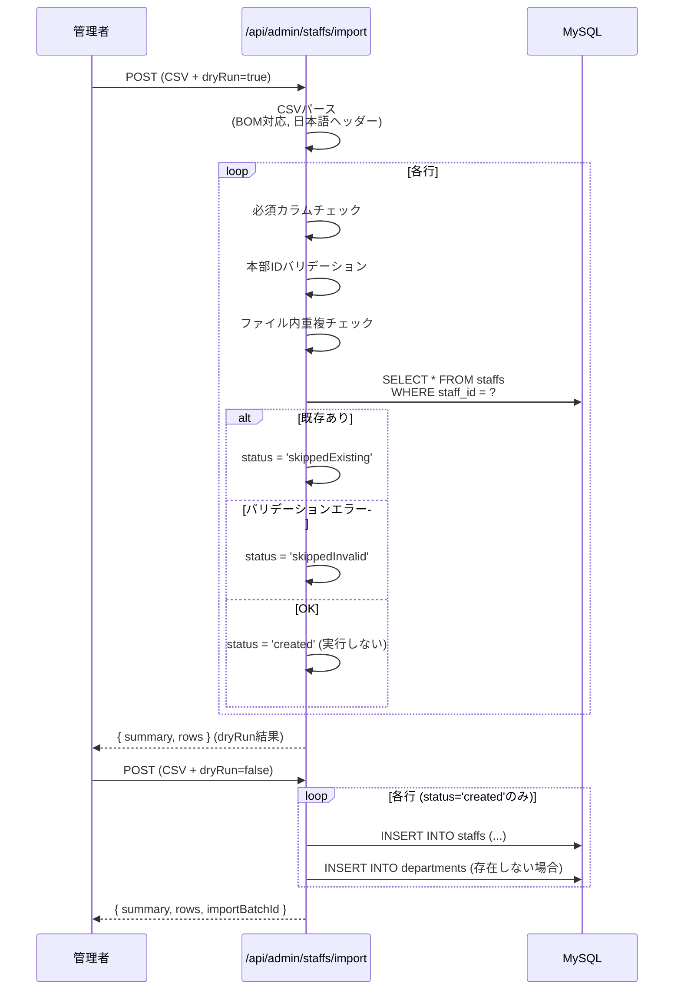
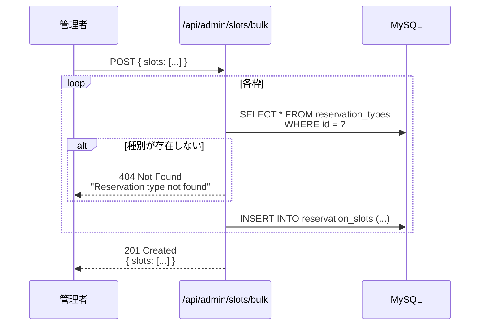
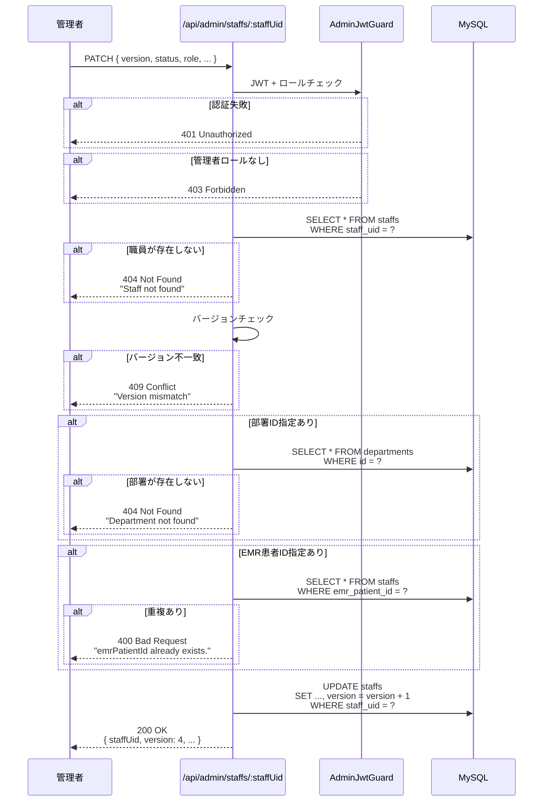
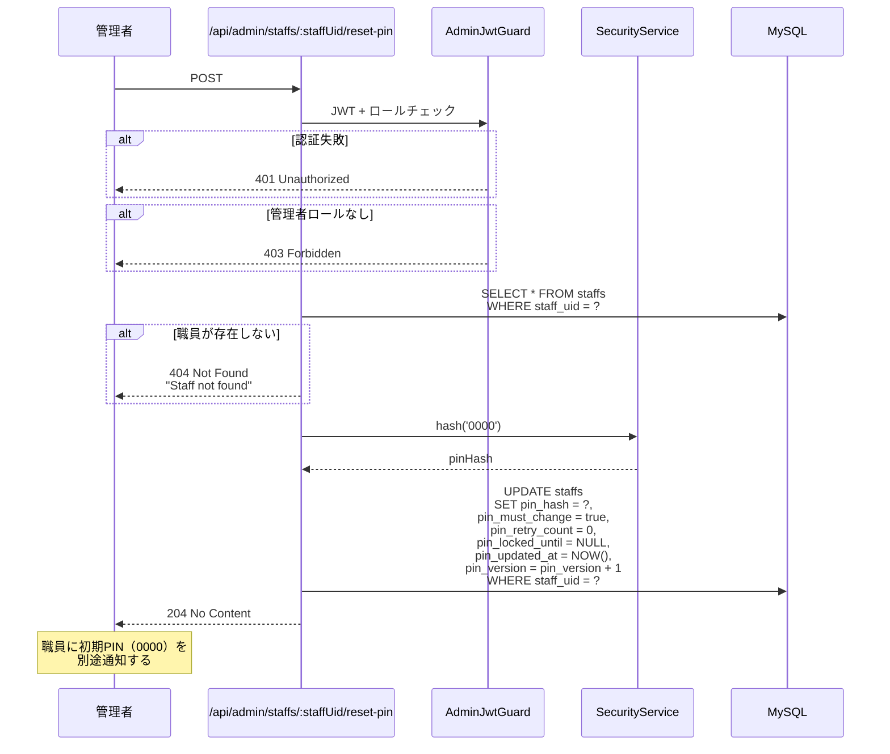

# 09. 管理者API

## 9.1 概要

管理者APIは、人事部・総務部の担当者が職員情報の一括登録や予約枠の設定を行う機能を提供します。

---

## 9.2 認証方式

### 管理者トークン認証

**ヘッダー形式**:
```http
X-Admin-Token: <admin_token>
Idempotency-Key: <unique_key>
```

| ヘッダー | 必須 | 説明 |
|---------|------|------|
| `X-Admin-Token` | ◯ | 環境変数 `ADMIN_TOKEN` の値 |
| `Idempotency-Key` | △ | べき等性キー（一括登録時に推奨） |

**環境変数**:
```bash
ADMIN_TOKEN=your-secret-admin-token
```

**エラー**:
- **401 Unauthorized**: トークン無効・未設定

---

## 9.3 POST /api/admin/staffs/import

### 概要
CSV形式で職員情報を一括登録します。

### 認証
管理者トークン認証

### リクエスト

**Headers**:
```http
X-Admin-Token: test-admin-token
Idempotency-Key: import-20251103-001
Content-Type: text/csv
```

**Body** (CSV形式):
```csv
名前(漢字),本部ID,部署,職種
山田太郎,900100,ER,医師
佐藤花子,900101,RAD,放射線技師
鈴木一郎,900102,VAC,看護師
```

**必須カラム**:
| カラム名 | 説明 | バリデーション |
|---------|------|---------------|
| `名前(漢字)` | 職員氏名 | 必須（空白不可） |
| `本部ID` | 職員ID | 必須・数字のみ |
| `部署` | 部署ID | 必須（空白不可） |
| `職種` | 職種 | 任意（未設定時は`未設定`） |

**クエリパラメータ**:
| パラメータ | 型 | デフォルト | 説明 |
|-----------|-----|----------|------|
| `dryRun` | string | `false` | `true`の場合、登録せずに検証のみ実行 |

**例**:
```bash
curl -X POST "http://localhost:3000/api/admin/staffs/import?dryRun=true" \
  -H "X-Admin-Token: test-admin-token" \
  -H "Idempotency-Key: import-20251103-001" \
  -H "Content-Type: text/csv" \
  --data-binary @staffs.csv
```

---

### レスポンス

#### 成功 (201 Created)

```json
{
  "summary": {
    "created": 2,
    "skippedExisting": 1,
    "skippedInvalid": 0,
    "duplicateInFile": 0,
    "warnings": []
  },
  "rows": [
    {
      "rowNumber": 2,
      "staffId": "900100",
      "status": "created"
    },
    {
      "rowNumber": 3,
      "staffId": "900101",
      "status": "skippedExisting"
    },
    {
      "rowNumber": 4,
      "staffId": "900102",
      "status": "created"
    }
  ],
  "importBatchId": "e742beb5-6957-4a7c-b9d2-6f5be4694618"
}
```

**summary**:
| フィールド | 型 | 説明 |
|-----------|-----|------|
| `created` | number | 新規登録数 |
| `skippedExisting` | number | 既存スキップ数 |
| `skippedInvalid` | number | バリデーションエラー数 |
| `duplicateInFile` | number | ファイル内重複数 |
| `warnings` | string[] | 警告メッセージ配列 |

**rows**:
| フィールド | 型 | 説明 |
|-----------|-----|------|
| `rowNumber` | number | CSV行番号（ヘッダー=1、データ開始=2） |
| `staffId` | string \| null | 職員ID |
| `status` | string | `created` / `skippedExisting` / `skippedInvalid` / `duplicateInFile` |
| `reason` | string[] | エラー理由（status=skippedInvalidの場合） |

**importBatchId**:
- `dryRun=false` かつ `created > 0` の場合のみ発行される一括登録ID

---

#### エラー

**401 Unauthorized** - トークン無効
```json
{
  "statusCode": 401,
  "message": "Invalid admin token"
}
```

---

### ビジネスルール

#### べき等性キー

`Idempotency-Key` ヘッダーを使用することで、同じCSVの重複実行を防止できます。

```http
Idempotency-Key: import-20251103-001
```

- 同じキーで再実行 → 既存データをスキップ（409を返さない）
- 異なるキー → 新規インポート

---

#### バリデーション

各行について以下をチェック：

1. **必須カラムの存在**
   - `名前(漢字)`, `本部ID`, `部署`, `職種`

2. **本部ID（職員ID）**
   - 数字のみ（`/^\d+$/` にマッチ）
   - 空白不可

3. **ファイル内重複チェック**
   - 同じ本部IDが複数行ある場合、すべて `duplicateInFile` ステータス

4. **既存チェック**
   - DBに既に存在する本部ID → `skippedExisting` ステータス

**バリデーション失敗例**:
```json
{
  "rowNumber": 3,
  "staffId": null,
  "status": "skippedInvalid",
  "reason": [
    "staffId is required.",
    "名前(漢字) is required."
  ]
}
```

---

#### 初期値

新規登録時、以下の初期値が設定されます：

| フィールド | 初期値 | 説明 |
|-----------|--------|------|
| `familyName` | CSV の `名前(漢字)` | 姓（CSVから分離不可のため同じ値） |
| `givenName` | CSV の `名前(漢字)` | 名（CSVから分離不可のため同じ値） |
| `emrPatientId` | `null` | 初回ログイン時に職員が設定 |
| `dateOfBirth` | `1900-01-01` | 初回ログイン時に職員が設定 |
| `sexCode` | `1` | 初回ログイン時に職員が設定 |
| `pinHash` | argon2(`0000`) | 初期PIN（初回ログイン時に変更必須） |
| `pinMustChange` | `true` | 初回ログイン時に強制変更 |
| `status` | `active` | 有効な職員 |
| `role` | `STAFF` | 一般職員 |
| `version` | `0` | 楽観ロックの初期値 |

---

### シーケンス図



---

### 使用例

#### Dry Run（検証のみ）

```bash
curl -X POST "http://localhost:3000/api/admin/staffs/import?dryRun=true" \
  -H "X-Admin-Token: test-admin-token" \
  -H "Idempotency-Key: import-20251103-001" \
  -H "Content-Type: text/csv" \
  --data-binary @staffs.csv
```

**レスポンス** (201 Created):
```json
{
  "summary": {
    "created": 3,
    "skippedExisting": 0,
    "skippedInvalid": 0,
    "duplicateInFile": 0,
    "warnings": []
  },
  "rows": [
    { "rowNumber": 2, "staffId": "900100", "status": "created" },
    { "rowNumber": 3, "staffId": "900101", "status": "created" },
    { "rowNumber": 4, "staffId": "900102", "status": "created" }
  ]
}
```

**確認後、本番実行**:
```bash
curl -X POST "http://localhost:3000/api/admin/staffs/import?dryRun=false" \
  -H "X-Admin-Token: test-admin-token" \
  -H "Idempotency-Key: import-20251103-001" \
  -H "Content-Type: text/csv" \
  --data-binary @staffs.csv
```

---

## 9.4 POST /api/admin/reservation-types

### 概要
予約種別（予防接種・健診等の種類）を作成します。

### 認証
管理者トークン認証

### リクエスト

**Headers**:
```http
X-Admin-Token: test-admin-token
Content-Type: application/json
```

**Body**:
| フィールド | 型 | 必須 | 説明 |
|-----------|-----|------|------|
| `name` | string | ◯ | 種別名（例: `Baseline Vaccination`） |
| `description` | string | - | 説明 |
| `active` | boolean | - | 有効フラグ（デフォルト: `true`） |

**例**:
```json
{
  "name": "Influenza Vaccination",
  "description": "インフルエンザ予防接種",
  "active": true
}
```

---

### レスポンス

#### 成功 (201 Created)

```json
{
  "id": 2,
  "name": "Influenza Vaccination",
  "description": "インフルエンザ予防接種",
  "active": true,
  "createdAt": "2025-11-03T10:00:00.000Z",
  "updatedAt": "2025-11-03T10:00:00.000Z"
}
```

| フィールド | 型 | 説明 |
|-----------|-----|------|
| `id` | number | 種別ID（自動採番） |
| `name` | string | 種別名 |
| `description` | string \| null | 説明 |
| `active` | boolean | 有効フラグ |
| `createdAt` | string | 作成日時 |
| `updatedAt` | string | 更新日時 |

---

#### エラー

**401 Unauthorized** - トークン無効
```json
{
  "statusCode": 401,
  "message": "Invalid admin token"
}
```

---

### 使用例

```bash
curl -X POST http://localhost:3000/api/admin/reservation-types \
  -H "X-Admin-Token: test-admin-token" \
  -H "Content-Type: application/json" \
  -d '{
    "name": "Annual Health Checkup",
    "description": "年次健康診断",
    "active": true
  }'
```

---

## 9.5 POST /api/admin/slots/bulk

### 概要
予約枠を一括作成します。

### 認証
管理者トークン認証

### リクエスト

**Headers**:
```http
X-Admin-Token: test-admin-token
Content-Type: application/json
```

**Body**:
| フィールド | 型 | 必須 | 説明 |
|-----------|-----|------|------|
| `slots` | array | ◯ | 予約枠配列 |

**slots配列の各要素**:
| フィールド | 型 | 必須 | 説明 |
|-----------|-----|------|------|
| `reservationTypeId` | number | ◯ | 予約種別ID |
| `serviceDateLocal` | string | ◯ | サービス提供日（YYYY-MM-DD） |
| `startMinuteOfDay` | number | ◯ | 開始分（0〜1439） |
| `durationMinutes` | number | ◯ | 所要時間（分） |
| `capacity` | number | ◯ | 定員 |
| `status` | string | ◯ | `draft` / `published` / `closed` |
| `bookingStart` | string | - | 受付開始日時（ISO 8601） |
| `bookingEnd` | string | - | 受付終了日時（ISO 8601） |
| `notes` | string | - | 備考 |
| `cancelDeadlineDateLocal` | string | - | キャンセル期限日（YYYY-MM-DD）※ `cancelDeadlineMinuteOfDay` と同時指定 |
| `cancelDeadlineMinuteOfDay` | number | - | キャンセル締切時刻（0〜1439 分）。`cancelDeadlineDateLocal` と同時指定。両方 `null` で期限なし |

**例**:
```json
{
  "slots": [
    {
      "reservationTypeId": 1,
      "serviceDateLocal": "2025-12-15",
      "startMinuteOfDay": 540,
      "durationMinutes": 30,
      "capacity": 10,
      "status": "published",
      "bookingStart": "2025-11-01T00:00:00+09:00",
      "bookingEnd": "2025-12-14T23:59:59+09:00",
      "cancelDeadlineDateLocal": "2025-12-14",
      "cancelDeadlineMinuteOfDay": 1020,
      "notes": "午前枠"
    },
    {
      "reservationTypeId": 1,
      "serviceDateLocal": "2025-12-15",
      "startMinuteOfDay": 840,
      "durationMinutes": 30,
      "capacity": 10,
      "status": "published",
      "bookingStart": "2025-11-01T00:00:00+09:00",
      "bookingEnd": "2025-12-14T23:59:59+09:00",
      "notes": "午後枠"
    }
  ]
}
```

---

### レスポンス

#### 成功 (201 Created)

```json
{
  "slots": [
    {
      "id": 10,
      "reservationTypeId": 1,
      "serviceDateLocal": "2025-12-15",
      "startMinuteOfDay": 540,
      "durationMinutes": 30,
      "capacity": 10,
      "bookedCount": 0,
      "status": "published",
      "bookingStart": "2025-11-01T00:00:00.000Z",
      "bookingEnd": "2025-12-14T23:59:59.000Z",
      "cancelDeadlineDateLocal": "2025-12-14",
      "cancelDeadlineMinuteOfDay": 1020,
      "notes": "午前枠",
      "createdAt": "2025-11-03T10:00:00.000Z",
      "updatedAt": "2025-11-03T10:00:00.000Z"
    },
    {
      "id": 11,
      "reservationTypeId": 1,
      "serviceDateLocal": "2025-12-15",
      "startMinuteOfDay": 840,
      "durationMinutes": 30,
      "capacity": 10,
      "bookedCount": 0,
      "status": "published",
      "bookingStart": "2025-11-01T00:00:00.000Z",
      "bookingEnd": "2025-12-14T23:59:59.000Z",
      "cancelDeadlineDateLocal": "2025-12-14",
      "cancelDeadlineMinuteOfDay": 1020,
      "notes": "午後枠",
      "createdAt": "2025-11-03T10:00:00.000Z",
      "updatedAt": "2025-11-03T10:00:00.000Z"
    }
  ]
}
```

**各slot**:
| フィールド | 型 | 説明 |
|-----------|-----|------|
| `id` | number | 枠ID（自動採番） |
| `reservationTypeId` | number | 予約種別ID |
| `serviceDateLocal` | string | サービス提供日 |
| `startMinuteOfDay` | number | 開始分 |
| `durationMinutes` | number | 所要時間 |
| `capacity` | number | 定員 |
| `bookedCount` | number | 現在の予約数（初期値: `0`） |
| `status` | string | ステータス |
| `bookingStart` | string \| null | 受付開始日時 |
| `bookingEnd` | string \| null | 受付終了日時 |
| `cancelDeadlineDateLocal` | string \| null | キャンセル期限日（YYYY-MM-DD） |
| `cancelDeadlineMinuteOfDay` | number \| null | キャンセル締切時刻（0〜1439 分） |
| `notes` | string \| null | 備考 |
| `createdAt` | string | 作成日時 |
| `updatedAt` | string | 更新日時 |

---

#### エラー

**401 Unauthorized** - トークン無効
```json
{
  "statusCode": 401,
  "message": "Invalid admin token"
}
```

**404 Not Found** - 予約種別が存在しない
```json
{
  "statusCode": 404,
  "message": "Reservation type not found"
}
```

---

### ビジネスルール

#### ステータスの意味

| ステータス | 説明 | 職員への表示 |
|-----------|------|------------|
| **draft** | 下書き | 非表示 |
| **published** | 公開中 | 表示・予約可能 |
| **closed** | 締切 | 表示（締切済み表示） |

**推奨フロー**:
1. `draft` で作成
2. 内容確認後、`published` に変更（別途PATCH APIが必要）
3. 受付終了後、`closed` に変更

---

#### 受付期間の設定

受付期間を設定しない場合（`bookingStart` / `bookingEnd` を `null` または未指定）:
- 枠が `published` の間は常に予約可能

受付期間を設定する場合:
- `bookingStart` 〜 `bookingEnd` の間のみ予約可能
- ISO 8601形式で指定（タイムゾーン: `+09:00`）

**例**:
```json
{
  "bookingStart": "2025-11-01T00:00:00+09:00",
  "bookingEnd": "2025-12-14T23:59:59+09:00"
}
```

→ 2025年11月1日 00:00 〜 2025年12月14日 23:59 まで受付

---

#### キャンセル期限

- `cancelDeadlineDateLocal` と `cancelDeadlineMinuteOfDay` は **同時指定必須**。片方のみ指定した場合は `400 Bad Request`
- 両方を `null` または未指定にすると「期限なし」として扱う
- `cancelDeadlineMinuteOfDay` は 0〜1439 の範囲（0=00:00、1439=23:59）
- 職員キャンセル (`DELETE /api/reservations/:id`) は **現在時刻(JST) <= 期限** の場合のみ成功。超過時は `409 Conflict` として `{"message":"Cancellation deadline passed"}` を返す
- 管理者キャンセル (`DELETE /api/admin/reservations/:id`) は期限を無視して常に成功（べき等204）

---

### シーケンス図



---

### 使用例

#### 1日分の枠を一括作成

```bash
curl -X POST http://localhost:3000/api/admin/slots/bulk \
  -H "X-Admin-Token: test-admin-token" \
  -H "Content-Type: application/json" \
  -d '{
    "slots": [
      {
        "reservationTypeId": 1,
        "serviceDateLocal": "2025-12-15",
        "startMinuteOfDay": 540,
        "durationMinutes": 30,
        "capacity": 10,
        "status": "draft",
        "bookingStart": "2025-11-01T00:00:00+09:00",
        "bookingEnd": "2025-12-14T23:59:59+09:00",
        "cancelDeadlineDateLocal": "2025-12-14",
        "cancelDeadlineMinuteOfDay": 1020
      },
      {
        "reservationTypeId": 1,
        "serviceDateLocal": "2025-12-15",
        "startMinuteOfDay": 600,
        "durationMinutes": 30,
        "capacity": 10,
        "status": "draft"
      },
      {
        "reservationTypeId": 1,
        "serviceDateLocal": "2025-12-15",
        "startMinuteOfDay": 660,
        "durationMinutes": 30,
        "capacity": 10,
        "status": "draft"
      }
    ]
  }'
```

---

## 9.6 べき等性の実装

### Idempotency-Keyの使用

管理者APIは `Idempotency-Key` ヘッダーによりべき等性を保証します。

**例**:
```http
POST /api/admin/staffs/import
X-Admin-Token: test-admin-token
Idempotency-Key: import-20251103-001
```

**動作**:
- 同じキーで再実行 → 既存データをスキップ（409を返さない）
- 異なるキー → 新規インポート

**キーの命名規則例**:
- `import-YYYYMMDD-NNN` (例: `import-20251103-001`)
- `bulk-slot-YYYYMMDD-HHmmss` (例: `bulk-slot-20251103-143000`)

---

## 9.7 CSV形式の詳細

### エンコーディング

- **文字コード**: UTF-8
- **BOM**: あり・なしの両方に対応
- **改行コード**: LF / CRLF の両方に対応

### 必須ヘッダー

```csv
名前(漢字),本部ID,部署,職種
```

**注意**: ヘッダー名は完全一致必須（全角括弧、大文字小文字も区別）

### サンプルCSV

```csv
名前(漢字),本部ID,部署,職種
山田太郎,900100,ER,医師
佐藤花子,900101,RAD,放射線技師
鈴木一郎,900102,VAC,看護師
田中美咲,900103,CARD,臨床検査技師
```

---

## 9.6 GET /api/admin/departments

### 概要
部署の一覧を取得します（ページネーション、フィルタリング、ソート機能付き）。

### 認証
管理者トークン認証

### リクエスト

**Headers**:
```http
X-Admin-Token: test-admin-token
```

**Query Parameters**:
| パラメータ | 型 | デフォルト | 説明 |
|-----------|-----|----------|------|
| `limit` | number | `50` | 1ページあたりの件数（最大100） |
| `page` | number | `1` | ページ番号（1から開始） |
| `name` | string | - | 部署名の部分一致検索（大文字小文字区別なし） |
| `active` | boolean | - | 有効フラグでフィルタ（`true`/`false`） |
| `sort` | string | `id` | ソート対象（`id`/`name`/`updatedAt`） |
| `order` | string | `asc` | ソート順（`asc`/`desc`） |

**例**:
```bash
curl -X GET "http://localhost:3000/api/admin/departments?limit=50&page=1&name=ER&active=true&sort=name&order=asc" \
  -H "X-Admin-Token: test-admin-token"
```

---

### レスポンス

#### 成功 (200 OK)

```json
{
  "data": [
    {
      "id": "CARD",
      "name": "Cardiology",
      "active": true,
      "createdAt": "2025-11-03T10:00:00.000Z",
      "updatedAt": "2025-11-03T10:00:00.000Z"
    },
    {
      "id": "ER",
      "name": "Emergency",
      "active": true,
      "createdAt": "2025-11-03T09:00:00.000Z",
      "updatedAt": "2025-11-03T09:00:00.000Z"
    }
  ],
  "meta": {
    "total": 2,
    "page": 1,
    "limit": 50
  }
}
```

**data配列の各要素**:
| フィールド | 型 | 説明 |
|-----------|-----|------|
| `id` | string | 部署ID |
| `name` | string | 部署名 |
| `active` | boolean | 有効フラグ |
| `createdAt` | string | 作成日時（ISO 8601） |
| `updatedAt` | string | 更新日時（ISO 8601） |

**meta**:
| フィールド | 型 | 説明 |
|-----------|-----|------|
| `total` | number | 総件数 |
| `page` | number | 現在のページ |
| `limit` | number | 1ページあたりの件数 |

---

#### エラー

**400 Bad Request** - パラメータ検証エラー
```json
{
  "statusCode": 400,
  "message": "limit must not be greater than 100"
}
```

**401 Unauthorized** - トークン無効
```json
{
  "statusCode": 401,
  "message": "Invalid admin token"
}
```

---

### ビジネスルール

#### ソート動作
- デフォルトは `id` の昇順
- 指定されたソートキーで並び替え後、安定性のため常に `id ASC` で第2ソート
- 例: `sort=name&order=desc` の場合、`ORDER BY name DESC, id ASC`

#### フィルタリング
- `name`: トリムされた文字列の部分一致（大文字小文字区別なし）
- `active`: 真偽値の完全一致

---

## 9.7 GET /api/admin/departments/:id

### 概要
特定の部署の詳細情報を取得します。

### 認証
管理者トークン認証

### リクエスト

**Headers**:
```http
X-Admin-Token: test-admin-token
```

**Path Parameters**:
| パラメータ | 型 | 説明 |
|-----------|-----|------|
| `id` | string | 部署ID |

**例**:
```bash
curl -X GET http://localhost:3000/api/admin/departments/ER \
  -H "X-Admin-Token: test-admin-token"
```

---

### レスポンス

#### 成功 (200 OK)

```json
{
  "id": "ER",
  "name": "Emergency",
  "active": true,
  "createdAt": "2025-11-03T09:00:00.000Z",
  "updatedAt": "2025-11-03T09:00:00.000Z"
}
```

---

#### エラー

**404 Not Found** - 部署が存在しない
```json
{
  "statusCode": 404,
  "message": "Department with id 'NONEXISTENT' not found"
}
```

---

## 9.8 GET /api/admin/reservation-types

### 概要
予約種別の一覧を取得します（ページネーション、フィルタリング、ソート機能付き）。

### 認証
管理者トークン認証

### リクエスト

**Headers**:
```http
X-Admin-Token: test-admin-token
```

**Query Parameters**:
| パラメータ | 型 | デフォルト | 説明 |
|-----------|-----|----------|------|
| `limit` | number | `50` | 1ページあたりの件数（最大100） |
| `page` | number | `1` | ページ番号（1から開始） |
| `name` | string | - | 種別名の部分一致検索（大文字小文字区別なし） |
| `active` | boolean | - | 有効フラグでフィルタ（`true`/`false`） |
| `sort` | string | `id` | ソート対象（`id`/`name`/`updatedAt`） |
| `order` | string | `asc` | ソート順（`asc`/`desc`） |

**例**:
```bash
curl -X GET "http://localhost:3000/api/admin/reservation-types?active=true&sort=name&order=asc" \
  -H "X-Admin-Token: test-admin-token"
```

---

### レスポンス

#### 成功 (200 OK)

```json
{
  "data": [
    {
      "id": 1,
      "name": "Annual Health Checkup",
      "description": "年次健康診断",
      "active": true,
      "createdAt": "2025-11-03T10:00:00.000Z",
      "updatedAt": "2025-11-03T10:00:00.000Z"
    },
    {
      "id": 2,
      "name": "Influenza Vaccination",
      "description": "インフルエンザ予防接種",
      "active": true,
      "createdAt": "2025-11-03T11:00:00.000Z",
      "updatedAt": "2025-11-03T11:00:00.000Z"
    }
  ],
  "meta": {
    "total": 2,
    "page": 1,
    "limit": 50
  }
}
```

---

## 9.9 GET /api/admin/reservation-types/:id

### 概要
特定の予約種別の詳細情報を取得します。

### 認証
管理者トークン認証

### リクエスト

**Path Parameters**:
| パラメータ | 型 | 説明 |
|-----------|-----|------|
| `id` | number | 予約種別ID |

**例**:
```bash
curl -X GET http://localhost:3000/api/admin/reservation-types/1 \
  -H "X-Admin-Token: test-admin-token"
```

---

### レスポンス

#### 成功 (200 OK)

```json
{
  "id": 1,
  "name": "Influenza Vaccination",
  "description": "インフルエンザ予防接種",
  "active": true,
  "createdAt": "2025-11-03T10:00:00.000Z",
  "updatedAt": "2025-11-03T10:00:00.000Z"
}
```

---

#### エラー

**404 Not Found** - 予約種別が存在しない
```json
{
  "statusCode": 404,
  "message": "Reservation type not found"
}
```

---

## 9.10 PATCH /api/admin/reservation-types/:id

### 概要
予約種別を更新します。

### 認証
管理者トークン認証

### リクエスト

**Headers**:
```http
X-Admin-Token: test-admin-token
Content-Type: application/json
```

**Path Parameters**:
| パラメータ | 型 | 説明 |
|-----------|-----|------|
| `id` | number | 予約種別ID |

**Body**:
| フィールド | 型 | 必須 | 説明 |
|-----------|-----|------|------|
| `name` | string | - | 種別名 |
| `description` | string | - | 説明 |
| `active` | boolean | - | 有効フラグ |

**例**:
```bash
curl -X PATCH http://localhost:3000/api/admin/reservation-types/1 \
  -H "X-Admin-Token: test-admin-token" \
  -H "Content-Type: application/json" \
  -d '{
    "name": "Influenza Vaccination 2025",
    "active": false
  }'
```

---

### レスポンス

#### 成功 (200 OK)

```json
{
  "id": 1,
  "name": "Influenza Vaccination 2025",
  "description": "インフルエンザ予防接種",
  "active": false,
  "createdAt": "2025-11-03T10:00:00.000Z",
  "updatedAt": "2025-11-04T15:00:00.000Z"
}
```

---

## 9.11 DELETE /api/admin/reservation-types/:id

### 概要
予約種別を削除します（物理削除）。

### 認証
管理者トークン認証

### リクエスト

**Path Parameters**:
| パラメータ | 型 | 説明 |
|-----------|-----|------|
| `id` | number | 予約種別ID |

**例**:
```bash
curl -X DELETE http://localhost:3000/api/admin/reservation-types/1 \
  -H "X-Admin-Token: test-admin-token"
```

---

### レスポンス

#### 成功 (200 OK)

```json
{}
```

---

#### エラー

**404 Not Found** - 予約種別が存在しない
```json
{
  "statusCode": 404,
  "message": "Reservation type not found"
}
```

---

## 9.12 POST /api/admin/slots/:id/departments

### 概要
予約枠に部署を割り当てます（部署別の定員オーバーライド機能付き）。

### 認証
管理者トークン認証

### リクエスト

**Headers**:
```http
X-Admin-Token: test-admin-token
Content-Type: application/json
```

**Path Parameters**:
| パラメータ | 型 | 説明 |
|-----------|-----|------|
| `id` | number | 予約枠ID |

**Body**:
| フィールド | 型 | 必須 | 説明 |
|-----------|-----|------|------|
| `departmentId` | string | ◯ | 部署ID |
| `enabled` | boolean | ◯ | 利用可否 |
| `capacityOverride` | number \| null | - | 部署別定員（nullの場合は枠全体の定員を使用） |

**例**:
```bash
curl -X POST http://localhost:3000/api/admin/slots/10/departments \
  -H "X-Admin-Token: test-admin-token" \
  -H "Content-Type: application/json" \
  -d '{
    "departmentId": "ER",
    "enabled": true,
    "capacityOverride": 5
  }'
```

---

### レスポンス

#### 成功 (201 Created)

```json
{
  "id": 1,
  "slotId": 10,
  "departmentId": "ER",
  "enabled": true,
  "capacityOverride": 5,
  "createdAt": "2025-11-04T10:00:00.000Z",
  "updatedAt": "2025-11-04T10:00:00.000Z"
}
```

---

#### エラー

**404 Not Found** - 予約枠または部署が存在しない
```json
{
  "statusCode": 404,
  "message": "Slot not found"
}
```

**409 Conflict** - 既に同じ部署が割り当て済み
```json
{
  "statusCode": 409,
  "message": "Department already linked to this slot"
}
```

---

## 9.13 PATCH /api/admin/slots/:slotId/departments/:deptId

### 概要
予約枠の部署割り当て設定を更新します。

### 認証
管理者トークン認証

### リクエスト

**Headers**:
```http
X-Admin-Token: test-admin-token
Content-Type: application/json
```

**Path Parameters**:
| パラメータ | 型 | 説明 |
|-----------|-----|------|
| `slotId` | number | 予約枠ID |
| `deptId` | string | 部署ID |

**Body**:
| フィールド | 型 | 必須 | 説明 |
|-----------|-----|------|------|
| `enabled` | boolean | - | 利用可否 |
| `capacityOverride` | number \| null | - | 部署別定員 |

**例**:
```bash
curl -X PATCH http://localhost:3000/api/admin/slots/10/departments/ER \
  -H "X-Admin-Token: test-admin-token" \
  -H "Content-Type: application/json" \
  -d '{
    "enabled": false,
    "capacityOverride": null
  }'
```

---

### レスポンス

#### 成功 (200 OK)

```json
{
  "id": 1,
  "slotId": 10,
  "departmentId": "ER",
  "enabled": false,
  "capacityOverride": null,
  "createdAt": "2025-11-04T10:00:00.000Z",
  "updatedAt": "2025-11-04T15:00:00.000Z"
}
```

---

#### エラー

**404 Not Found** - 割り当てが存在しない
```json
{
  "statusCode": 404,
  "message": "Slot-department link not found"
}
```

---

## 9.14 DELETE /api/admin/slots/:slotId/departments/:deptId

### 概要
予約枠の部署割り当てを削除します（冪等）。

### 認証
管理者トークン認証

### リクエスト

**Headers**:
```http
X-Admin-Token: test-admin-token
```

**Path Parameters**:
| パラメータ | 型 | 説明 |
|-----------|-----|------|
| `slotId` | number | 予約枠ID |
| `deptId` | string | 部署ID |

**例**:
```bash
curl -X DELETE http://localhost:3000/api/admin/slots/10/departments/ER \
  -H "X-Admin-Token: test-admin-token"
```

---

### レスポンス

#### 成功 (204 No Content)

レスポンスボディなし。

---

### ビジネスルール

#### 冪等性
- 2回目以降の削除も `204 No Content` を返す
- 存在しない割り当ての削除もエラーにならない

---

## 9.15 べき等性の実装

### Idempotency-Keyの使用

管理者APIは `Idempotency-Key` ヘッダーによりべき等性を保証します。

**例**:
```http
POST /api/admin/staffs/import
X-Admin-Token: test-admin-token
Idempotency-Key: import-20251103-001
```

**動作**:
- 同じキーで再実行 → 既存データをスキップ（409を返さない）
- 異なるキー → 新規インポート

**キーの命名規則例**:
- `import-YYYYMMDD-NNN` (例: `import-20251103-001`)
- `bulk-slot-YYYYMMDD-HHmmss` (例: `bulk-slot-20251103-143000`)

---

## 9.16 CSV形式の詳細

### エンコーディング

- **文字コード**: UTF-8
- **BOM**: あり・なしの両方に対応
- **改行コード**: LF / CRLF の両方に対応

### 必須ヘッダー

```csv
名前(漢字),本部ID,部署,職種
```

**注意**: ヘッダー名は完全一致必須（全角括弧、大文字小文字も区別）

### サンプルCSV

```csv
名前(漢字),本部ID,部署,職種
山田太郎,900100,ER,医師
佐藤花子,900101,RAD,放射線技師
鈴木一郎,900102,VAC,看護師
田中美咲,900103,CARD,臨床検査技師
```

---

## 9.17 PATCH /api/admin/staffs/:staffUid

### 概要
管理者が職員情報を更新します。本人では変更できない `status` や `role` フィールドも更新可能です。

### 認証
JWT Bearer認証 + 管理者ロール（`role: 'ADMIN'`）

**注意**: この管理者APIは `X-Admin-Token` ではなく、管理者ロールを持つ職員の **JWT Bearer トークン** を使用します。

### リクエスト

**Headers**:
```http
Authorization: Bearer <admin_jwt_token>
Content-Type: application/json
```

**Path Parameters**:
| パラメータ | 型 | 必須 | 説明 |
|-----------|-----|------|------|
| `staffUid` | string | ◯ | 職員UUID |

**Body**:
| フィールド | 型 | 必須 | 説明 | バリデーション |
|-----------|-----|------|------|---------------|
| `version` | number | ◯ | 楽観ロックバージョン | 0以上の整数 |
| `familyName` | string | - | 姓 | 1-100文字 |
| `givenName` | string | - | 名 | 1-100文字 |
| `familyNameKana` | string | - | 姓カナ | 1-100文字 |
| `givenNameKana` | string | - | 名カナ | 1-100文字 |
| `jobTitle` | string | - | 職種 | 任意文字列 |
| `departmentId` | string | - | 部署ID | 既存部署のみ |
| `emrPatientId` | string | - | EMR患者ID | 数字のみ、最大64桁、重複不可 |
| `dateOfBirth` | string | - | 生年月日 | YYYY-MM-DD形式 |
| `sexCode` | string | - | 性別コード | `1` または `2` |
| `status` | string | - | ステータス | `active` / `suspended` / `left` |
| `role` | string | - | ロール | `STAFF` / `ADMIN` |

**例**:
```json
{
  "version": 3,
  "familyName": "山田",
  "givenName": "太郎",
  "familyNameKana": "やまだ",
  "givenNameKana": "たろう",
  "jobTitle": "医師",
  "departmentId": "ER",
  "emrPatientId": "123456",
  "dateOfBirth": "1990-05-15",
  "sexCode": "1",
  "status": "active",
  "role": "STAFF"
}
```

---

### レスポンス

#### 成功 (200 OK)

更新後の職員情報を返します。

```json
{
  "staffUid": "e742beb5-6957-4a7c-b9d2-6f5be4694618",
  "staffId": "900100",
  "emrPatientId": "123456",
  "familyName": "山田",
  "givenName": "太郎",
  "familyNameKana": "やまだ",
  "givenNameKana": "たろう",
  "jobTitle": "医師",
  "departmentId": "ER",
  "dateOfBirth": "1990-05-15",
  "sexCode": "1",
  "status": "active",
  "role": "STAFF",
  "version": 4,
  "pinMustChange": false,
  "pinRetryCount": 0,
  "pinLockedUntil": null,
  "lastLoginAt": "2025-11-03T09:00:00.000Z",
  "createdAt": "2025-04-01T00:00:00.000Z",
  "updatedAt": "2025-11-04T10:00:00.000Z"
}
```

---

#### エラー

**400 Bad Request** - バリデーションエラー
```json
{
  "statusCode": 400,
  "message": [
    "version must be an integer number",
    "familyName must be longer than or equal to 1 characters"
  ],
  "error": "Bad Request"
}
```

**400 Bad Request** - EMR患者ID重複
```json
{
  "statusCode": 400,
  "message": "emrPatientId already exists."
}
```

**401 Unauthorized** - 認証失敗
```json
{
  "statusCode": 401,
  "message": "Unauthorized"
}
```

**403 Forbidden** - 管理者権限なし
```json
{
  "statusCode": 403,
  "message": "Forbidden resource"
}
```

**404 Not Found** - 職員が存在しない
```json
{
  "statusCode": 404,
  "message": "Staff not found"
}
```

**404 Not Found** - 部署が存在しない
```json
{
  "statusCode": 404,
  "message": "Department not found"
}
```

**409 Conflict** - バージョン不一致（楽観ロック失敗）
```json
{
  "statusCode": 409,
  "message": "Version mismatch"
}
```

---

### ビジネスルール

#### 管理者のみが変更可能なフィールド

以下のフィールドは管理者のみが変更可能です：

- `status` - 職員のステータス（`active` / `suspended` / `left`）
- `role` - 職員のロール（`STAFF` / `ADMIN`）

**一般職員の場合**: 403 Forbidden エラーが返されます。

#### 楽観ロック

`version` フィールドで更新競合を検出します。

```typescript
// 更新前にバージョンをチェック
if (staff.version !== payload.version) {
  throw new ConflictException('Version mismatch');
}

// 更新時に自動インクリメント
staff.version += 1;
```

**対処**: 409エラーが返された場合、最新データを再取得してから再試行。

#### 外部キー制約

- **departmentId**: 部署テーブルに存在する部署IDのみ指定可能
- **emrPatientId**: 他の職員と重複不可（UNIQUE制約）

---

### シーケンス図



---

### 使用例

#### 職員のステータスを変更

```bash
curl -X PATCH http://localhost:3000/api/admin/staffs/e742beb5-6957-4a7c-b9d2-6f5be4694618 \
  -H "Authorization: Bearer <admin_jwt_token>" \
  -H "Content-Type: application/json" \
  -d '{
    "version": 3,
    "status": "suspended"
  }'
```

#### 職員を管理者に昇格

```bash
curl -X PATCH http://localhost:3000/api/admin/staffs/e742beb5-6957-4a7c-b9d2-6f5be4694618 \
  -H "Authorization: Bearer <admin_jwt_token>" \
  -H "Content-Type: application/json" \
  -d '{
    "version": 3,
    "role": "ADMIN"
  }'
```

#### 複数フィールドを一括更新

```bash
curl -X PATCH http://localhost:3000/api/admin/staffs/e742beb5-6957-4a7c-b9d2-6f5be4694618 \
  -H "Authorization: Bearer <admin_jwt_token>" \
  -H "Content-Type: application/json" \
  -d '{
    "version": 3,
    "familyName": "佐藤",
    "givenName": "花子",
    "departmentId": "RAD",
    "emrPatientId": "654321",
    "status": "active",
    "role": "STAFF"
  }'
```

---

## 9.18 POST /api/admin/staffs/:staffUid/reset-pin

### 概要
管理者が職員のPINを初期値（`0000`）にリセットします。職員は次回ログイン時にPIN変更を要求されます。

### 認証
JWT Bearer認証 + 管理者ロール（`role: 'ADMIN'`）

### リクエスト

**Headers**:
```http
Authorization: Bearer <admin_jwt_token>
```

**Path Parameters**:
| パラメータ | 型 | 必須 | 説明 |
|-----------|-----|------|------|
| `staffUid` | string | ◯ | 職員UUID |

**Body**: なし

**例**:
```bash
curl -X POST http://localhost:3000/api/admin/staffs/e742beb5-6957-4a7c-b9d2-6f5be4694618/reset-pin \
  -H "Authorization: Bearer <admin_jwt_token>"
```

---

### レスポンス

#### 成功 (204 No Content)

レスポンスボディなし。

---

#### エラー

**401 Unauthorized** - 認証失敗
```json
{
  "statusCode": 401,
  "message": "Unauthorized"
}
```

**403 Forbidden** - 管理者権限なし
```json
{
  "statusCode": 403,
  "message": "Forbidden resource"
}
```

**404 Not Found** - 職員が存在しない
```json
{
  "statusCode": 404,
  "message": "Staff not found"
}
```

---

### ビジネスルール

#### PINリセット処理

1. PINを初期値（`0000`）でハッシュ化
2. 以下のフィールドを更新：
   - `pinHash`: 初期値のハッシュ
   - `pinMustChange`: `true` に設定
   - `pinRetryCount`: `0` にリセット
   - `pinLockedUntil`: `null` にリセット
   - `pinUpdatedAt`: 現在時刻に設定
   - `pinVersion`: インクリメント

**効果**:
- 職員は初期PIN（`0000`）でログイン可能になる
- ログイン後、PIN変更が強制される（`pinMustChange: true`）
- PINロックが解除される

#### 使用シーン

- 職員がPINを忘れた場合
- 職員のアカウントがロックされた場合（PIN失敗5回）
- セキュリティ上の理由で強制的にPIN変更させたい場合

---

### シーケンス図



---

### 使用例

#### PINリセットの実行

```bash
# 1. 管理者がPINをリセット
curl -X POST http://localhost:3000/api/admin/staffs/e742beb5-6957-4a7c-b9d2-6f5be4694618/reset-pin \
  -H "Authorization: Bearer <admin_jwt_token>"

# レスポンス: 204 No Content

# 2. 職員が初期PINでログイン
curl -X POST http://localhost:3000/api/auth/login \
  -H "Content-Type: application/json" \
  -d '{
    "staffId": "900100",
    "pin": "0000"
  }'

# レスポンス: 200 OK
# {
#   "tokenType": "Bearer",
#   "accessToken": "eyJhbGc...",
#   "refreshToken": "...",
#   "expiresIn": 900,
#   "pinMustChange": true  ← PIN変更が必須
# }

# 3. 職員がPINを変更
curl -X POST http://localhost:3000/api/staffs/me/pin \
  -H "Authorization: Bearer <staff_access_token>" \
  -H "Content-Type: application/json" \
  -d '{
    "currentPin": "0000",
    "newPin": "1234"
  }'

# レスポンス: 204 No Content
```

---

## 9.19 認証方式の使い分け

### X-Admin-Token 方式

**対象API**:
- `POST /api/admin/staffs/import` - 職員一括登録
- `POST /api/admin/reservation-types` - 予約種別作成
- `POST /api/admin/slots/bulk` - 予約枠一括作成
- `GET /api/admin/departments` - 部署一覧（管理者用）
- `GET /api/admin/departments/:id` - 部署詳細
- `GET /api/admin/reservation-types` - 予約種別一覧（管理者用）
- その他のリソース管理API

**特徴**:
- 環境変数 `ADMIN_TOKEN` で設定された固定トークン
- 特定の管理者個人に紐付かない
- システム管理者・外部スクリプトからの呼び出しに適している

**ヘッダー**:
```http
X-Admin-Token: <admin_token>
```

### JWT Bearer + Admin Role 方式

**対象API**:
- `PATCH /api/admin/staffs/:staffUid` - 職員情報更新
- `POST /api/admin/staffs/:staffUid/reset-pin` - PINリセット

**特徴**:
- 管理者ロール（`role: 'ADMIN'`）を持つ職員のJWTトークン
- 操作履歴を特定の管理者に紐付けられる
- 監査ログに管理者のstaffIdが記録される

**ヘッダー**:
```http
Authorization: Bearer <admin_jwt_token>
```

**取得方法**:
```bash
# 1. 管理者としてログイン
curl -X POST http://localhost:3000/api/auth/login \
  -H "Content-Type: application/json" \
  -d '{
    "staffId": "900001",
    "pin": "1234"
  }'

# レスポンス:
# {
#   "accessToken": "eyJhbGc...",  ← このトークンを使用
#   "role": "ADMIN"
# }

# 2. 管理者APIを呼び出し
curl -X PATCH http://localhost:3000/api/admin/staffs/<staffUid> \
  -H "Authorization: Bearer eyJhbGc..." \
  -H "Content-Type: application/json" \
  -d '{ "version": 3, "status": "suspended" }'
```

---

## 9.20 GET /api/admin/slots

### 概要
予約枠を検索・ページング付きで取得します。キャンセル期限や受付期間を含む管理向けビューです。

### 認証
管理者トークン認証

### リクエスト

**Headers**:
```http
X-Admin-Token: test-admin-token
```

**Query Parameters**:
| パラメータ | 型 | デフォルト | 説明 |
|-----------|-----|----------|------|
| `reservationTypeId` | number | - | 予約種別IDでフィルタ |
| `status` | string | - | `draft` / `published` / `closed` |
| `serviceDateFrom` | string | - | サービス提供日（YYYY-MM-DD）下限 |
| `serviceDateTo` | string | - | サービス提供日（YYYY-MM-DD）上限 |
| `page` | number | `1` | ページ番号（1開始） |
| `limit` | number | `50` | 1ページ件数（最大100） |
| `sort` | string | `serviceDateLocal` | `serviceDateLocal` / `startMinuteOfDay` / `updatedAt` |
| `order` | string | `asc` | `asc` / `desc` |

**例**:
```bash
curl -X GET "http://localhost:3000/api/admin/slots?reservationTypeId=1&status=published&sort=updatedAt&order=desc" \
  -H "X-Admin-Token: test-admin-token"
```

### レスポンス

```json
{
  "data": [
    {
      "id": 11,
      "reservationTypeId": 1,
      "serviceDateLocal": "2025-12-15",
      "startMinuteOfDay": 540,
      "durationMinutes": 30,
      "capacity": 10,
      "bookedCount": 3,
      "status": "published",
      "bookingStart": "2025-11-01T00:00:00.000Z",
      "bookingEnd": "2025-12-14T23:59:59.000Z",
      "cancelDeadlineDateLocal": "2025-12-14",
      "cancelDeadlineMinuteOfDay": 1020,
      "notes": "午前枠",
      "updatedAt": "2025-11-04T10:00:00.000Z"
    }
  ],
  "meta": {
    "total": 1,
    "page": 1,
    "limit": 50
  }
}
```

### ビジネスルール

- ソートは指定フィールド＋`id ASC` の安定ソート
- `serviceDateFrom` ≤ `serviceDateTo` を検証（違反時は 400）
- 日付はローカル日付（YYYY-MM-DD）で比較

---

## 9.21 PATCH /api/admin/slots/:id

### 概要
予約枠を部分更新します。受付期間、定員、キャンセル期限などを柔軟に変更できます。

### 認証
管理者トークン認証

### リクエスト

| フィールド | 型 | 説明 |
|-----------|-----|------|
| `capacity` | number | 定員（0以上） |
| `status` | string | `draft` / `published` / `closed` |
| `notes` | string \| null | 備考（`null` でクリア） |
| `bookingStart` | string \| null | 受付開始日時（ISO 8601） |
| `bookingEnd` | string \| null | 受付終了日時（ISO 8601） |
| `cancelDeadlineDateLocal` | string \| null | キャンセル期限日（YYYY-MM-DD） |
| `cancelDeadlineMinuteOfDay` | number \| null | キャンセル締切時刻（0〜1439 分） |

### レスポンス

```json
{
  "id": 11,
  "reservationTypeId": 1,
  "capacity": 12,
  "status": "closed",
  "cancelDeadlineDateLocal": "2025-12-13",
  "cancelDeadlineMinuteOfDay": 1200,
  "updatedAt": "2025-11-04T12:00:00.000Z"
}
```

### バリデーション

- `capacity >= 0`
- `bookingStart` / `bookingEnd` は ISO 8601。双方指定時は `bookingStart <= bookingEnd`
- `cancelDeadlineDateLocal` と `cancelDeadlineMinuteOfDay` は同時指定（片方のみ → 400）
- `cancelDeadlineMinuteOfDay` は 0〜1439
- キャパシティ縮小時は `bookedCount` が上限に丸め込まれる

---

## 9.22 GET /api/admin/reservations

### 概要
予約履歴を管理者向けに一覧取得します。職員名・部署・キャンセル状態を確認できます。

### 認証
管理者トークン認証

### クエリ
| パラメータ | 型 | デフォルト | 説明 |
|-----------|-----|----------|------|
| `staffId` | string | - | 職員IDの部分一致 |
| `reservationTypeId` | number | - | 予約種別ID |
| `status` | string | - | `active` / `canceled` |
| `serviceDateFrom` | string | - | サービス提供日（下限） |
| `serviceDateTo` | string | - | サービス提供日（上限） |
| `page` | number | `1` | ページ |
| `limit` | number | `50` | 1ページ件数（最大100） |
| `sort` | string | `updatedAt` | `serviceDateLocal` / `updatedAt` |
| `order` | string | `desc` | `asc` / `desc` |

### レスポンス

```json
{
  "data": [
    {
      "id": 101,
      "staffUid": "550e8400-e29b-41d4-a716-446655440000",
      "staffId": "900100",
      "staffName": "山田太郎",
      "departmentId": "ER",
      "reservationTypeId": 1,
      "slotId": 11,
      "serviceDateLocal": "2025-12-15",
      "startMinuteOfDay": 540,
      "durationMinutes": 30,
      "canceledAt": null,
      "updatedAt": "2025-11-04T10:00:00.000Z"
    }
  ],
  "meta": {
    "total": 1,
    "page": 1,
    "limit": 50
  }
}
```

### ビジネスルール

- `status=active` → `canceledAt IS NULL`
- `status=canceled` → `canceledAt IS NOT NULL`
- `serviceDateFrom` ≤ `serviceDateTo` を検証
- 職員名は `familyName + givenName`

---

## 9.23 DELETE /api/admin/reservations/:id

### 概要
予約を論理キャンセルします。存在しないIDや既キャンセルでも常に204（べき等）。

### 認証
管理者トークン認証

### レスポンス

- **204 No Content**

### ビジネスルール

- `reservations.canceledAt` に現在時刻を設定
- 対応する `reservation_slots.booked_count` を1減算（下限0）
- キャンセル期限の有無に関わらず常に成功

---

## 9.24 GET /api/admin/staffs

### 概要
職員一覧を検索・ページング付きで取得します。氏名・部署・最終ログインなどを確認できます。

### 認証
管理者トークン認証

### クエリ
| パラメータ | 型 | デフォルト | 説明 |
|-----------|-----|----------|------|
| `search` | string | - | 氏名（漢字・カナ）/職員IDの部分一致。トリム後空文字は無視 |
| `departmentId` | string | - | 部署ID |
| `status` | string | - | `active` / `inactive` (`inactive` は `status != 'active'`) |
| `page` | number | `1` | ページ |
| `limit` | number | `50` | 1ページ件数（最大100） |

### レスポンス

```json
{
  "data": [
    {
      "staffUid": "550e8400-e29b-41d4-a716-446655440000",
      "staffId": "900100",
      "familyName": "山田",
      "givenName": "太郎",
      "departmentId": "ER",
      "jobTitle": "医師",
      "status": "active",
      "lastLoginAt": "2025-11-03T09:00:00.000Z",
      "updatedAt": "2025-11-03T10:00:00.000Z"
    }
  ],
  "meta": {
    "total": 1,
    "page": 1,
    "limit": 50
  }
}
```

### ビジネスルール

- 並び順は `updatedAt DESC, staffUid ASC`
- `search` は漢字/カナ/職員IDの OR 条件で部分一致検索

---

## 9.25 POST /api/admin/staffs/:staffUid/unlock

### 概要
PINロックを解除します。対象が存在しない場合でも 204 を返す冪等APIです。

### 認証
管理者トークン認証

### レスポンス

- **204 No Content**

### ビジネスルール

- `pin_retry_count` を 0、`pin_locked_until` を `NULL` にリセット
- `pinMustChange` は `true` に再設定
- 存在しない `staffUid` も 204（UI簡素化）

---

## 9.26 POST /api/admin/departments

### 概要
部署を新規作成します。

### 認証
管理者トークン認証

### リクエスト

| フィールド | 型 | 必須 | 説明 |
|-----------|-----|------|------|
| `id` | string | ◯ | 部署ID（最大100文字） |
| `name` | string | ◯ | 部署名 |
| `active` | boolean | - | 有効フラグ（既定: true） |

### レスポンス

```json
{
  "id": "LAB",
  "name": "Laboratory",
  "active": true,
  "createdAt": "2025-11-04T12:00:00.000Z",
  "updatedAt": "2025-11-04T12:00:00.000Z"
}
```

### エラー
- **409 Conflict**: 既に同じIDが存在

---

## 9.27 PATCH /api/admin/departments/:id

### 概要
部署名や有効フラグを更新します。

### 認証
管理者トークン認証

### リクエスト

| フィールド | 型 | 説明 |
|-----------|-----|------|
| `name` | string | 部署名（最大255文字） |
| `active` | boolean | 有効フラグ |

### レスポンス

```json
{
  "id": "QA",
  "name": "QA Center",
  "active": false,
  "createdAt": "2025-11-03T09:00:00.000Z",
  "updatedAt": "2025-11-04T12:15:00.000Z"
}
```

### エラー
- **404 Not Found**: 指定IDが存在しない

---

## 9.30 関連ドキュメント

- **[05-API-Overview.md](./05-API-Overview.md)** - API共通仕様
- **[07-Staff-API.md](./07-Staff-API.md)** - 職員API（本人更新）
- **[13-Business-Rules.md](./13-Business-Rules.md)** - 業務ルール（べき等性）
- **[03-Data-Model.md](./03-Data-Model.md)** - データモデル（初期値・制約）

---

**最終更新**: 2025-11-04
**バージョン**: 3.1.0
