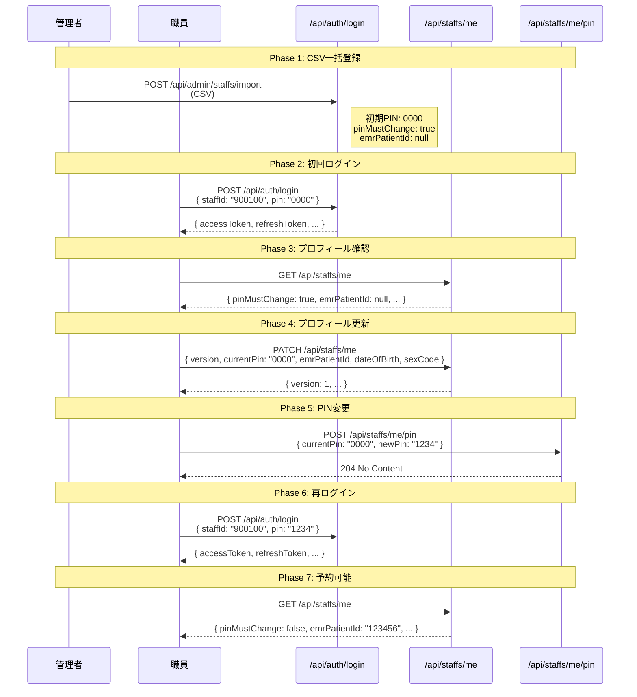
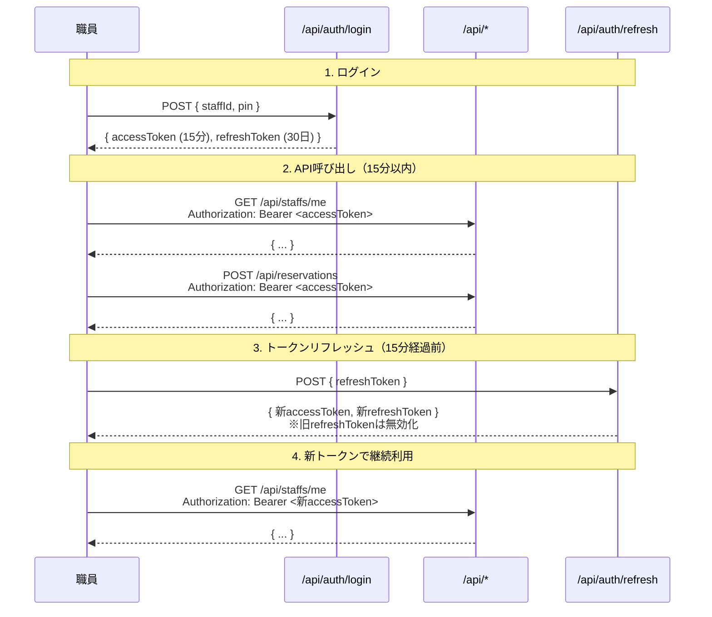
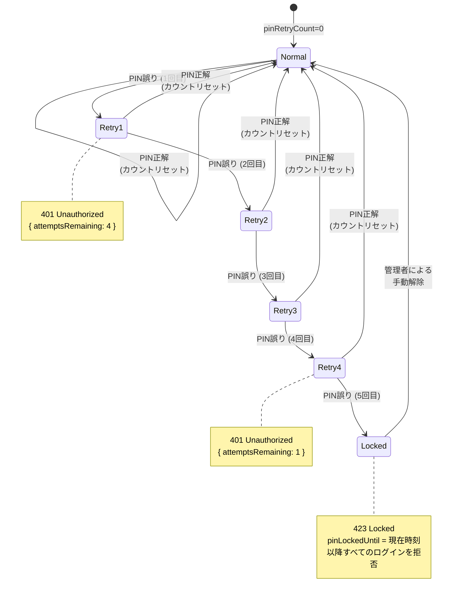
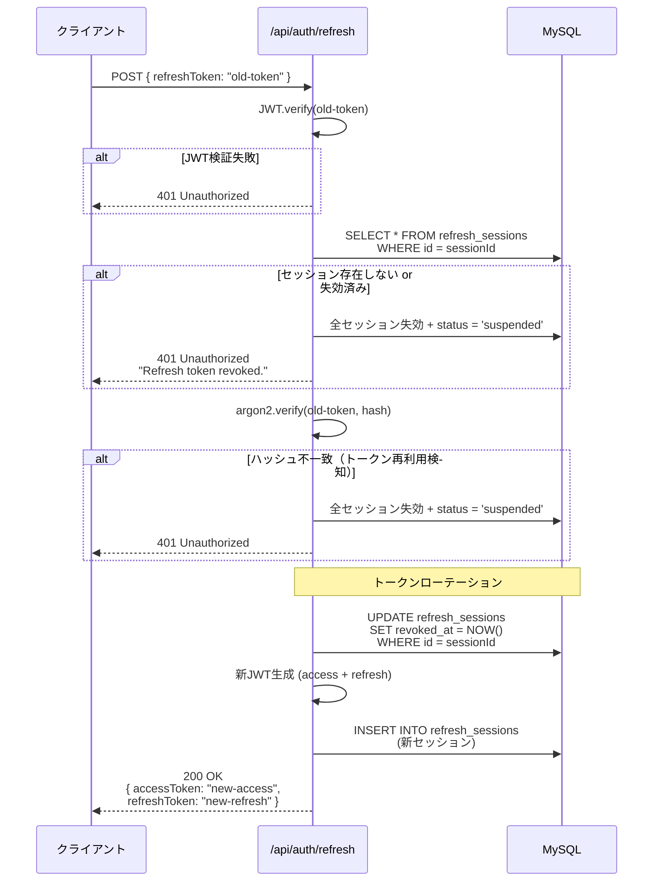
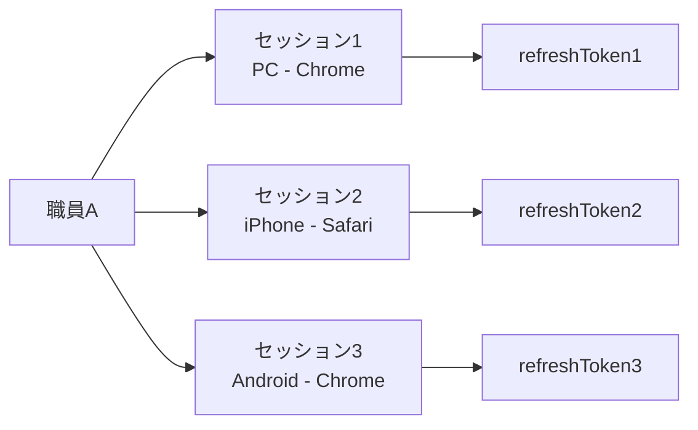
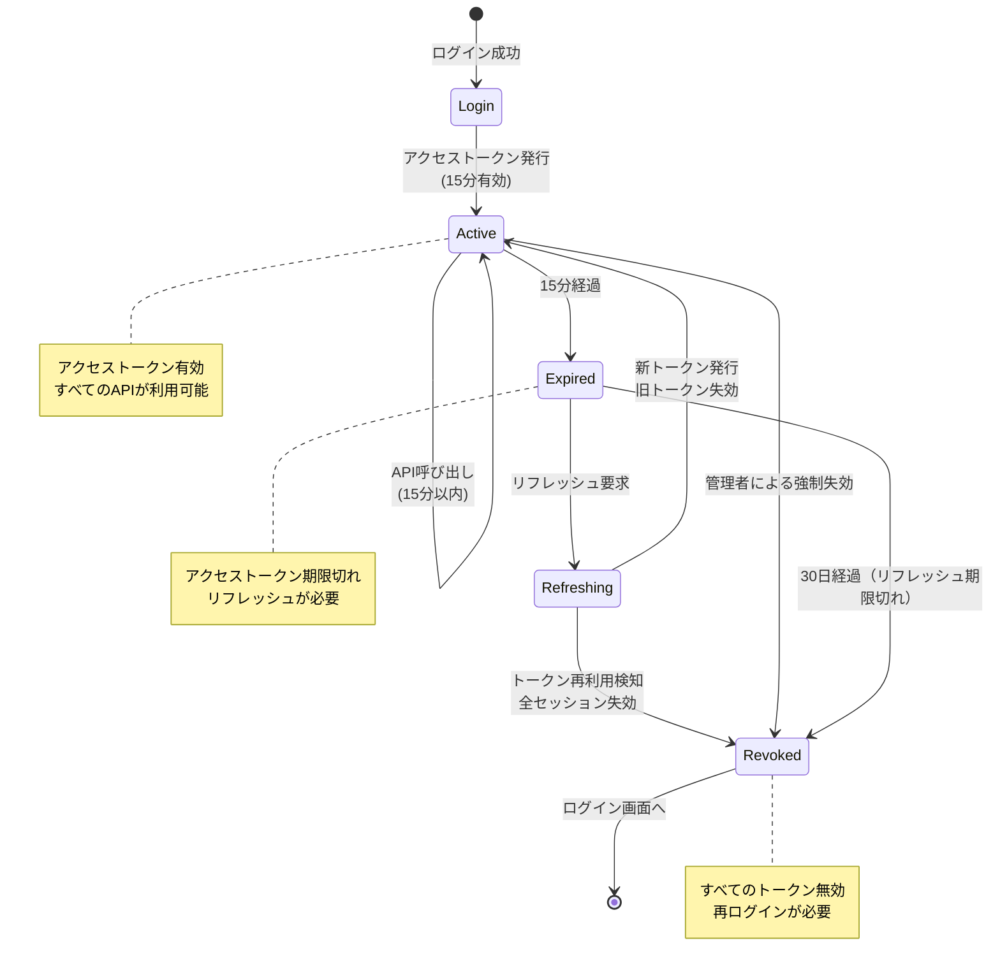

# 10. 認証フロー詳細

## 10.1 概要

このドキュメントでは、予約管理システムの認証フロー全体を説明します。

---

## 10.2 認証方式の概要

### 10.2.1 職員認証（JWT Bearer認証）

| 項目 | 内容 |
|------|------|
| **認証方法** | 職員ID + 4桁PIN |
| **トークン形式** | JWT (JSON Web Token) |
| **アクセストークン有効期限** | 15分（`JWT_EXPIRES_IN=900s`） |
| **リフレッシュトークン有効期限** | 30日（`REFRESH_EXPIRES_IN=30d`） |
| **セキュリティ機能** | トークンローテーション・再利用検知 |

---

### 10.2.2 管理者認証（固定トークン）

| 項目 | 内容 |
|------|------|
| **認証方法** | 固定トークン（環境変数） |
| **ヘッダー** | `X-Admin-Token` |
| **使用箇所** | `/api/admin/*` エンドポイント |

---

## 10.3 JWT トークン構造

### 10.3.1 アクセストークン

**有効期限**: 15分

**ペイロード**:
```json
{
  "sub": "e742beb5-6957-4a7c-b9d2-6f5be4694618",
  "sid": "900100",
  "role": "STAFF",
  "status": "active",
  "iat": 1699001234,
  "exp": 1699002134
}
```

| フィールド | 説明 |
|-----------|------|
| `sub` | 職員UUID（`staff_uid`） |
| `sid` | 職員ID（`staff_id`） |
| `role` | ロール（`STAFF` または `ADMIN`） |
| `status` | ステータス（`active` / `suspended` / `left`） |
| `iat` | 発行日時（UNIX timestamp） |
| `exp` | 有効期限（UNIX timestamp） |

**用途**: API呼び出し時の認証

---

### 10.3.2 リフレッシュトークン

**有効期限**: 30日

**ペイロード**:
```json
{
  "sub": "e742beb5-6957-4a7c-b9d2-6f5be4694618",
  "sid": "900100",
  "sessionId": 5,
  "iat": 1699001234,
  "exp": 1701593234
}
```

| フィールド | 説明 |
|-----------|------|
| `sub` | 職員UUID |
| `sid` | 職員ID |
| `sessionId` | セッションID（`refresh_sessions.id`） |
| `iat` | 発行日時 |
| `exp` | 有効期限（30日後） |

**用途**: アクセストークンの再発行

---

## 10.4 初回ログインフロー

### 10.4.1 概要

新規職員は以下の手順でシステムを利用開始します：

1. CSV一括登録（管理者）
2. 初回ログイン（PIN=0000）
3. プロフィール更新（EMR患者ID等）
4. PIN変更（0000→新PIN）
5. 再ログイン
6. 予約可能

---

### 10.4.2 フロー図



---

### 10.4.3 初期状態

CSV一括登録時、以下の初期値が設定されます：

| フィールド | 初期値 | 理由 |
|-----------|--------|------|
| `pinHash` | argon2(`0000`) | 共通の初期PIN |
| `pinMustChange` | `true` | 初回ログイン時に強制変更 |
| `emrPatientId` | `null` | 職員が自身で登録 |
| `dateOfBirth` | `1900-01-01` | 仮値（職員が更新必須） |
| `sexCode` | `1` | 仮値（職員が更新可能） |
| `status` | `active` | 有効な職員 |
| `role` | `STAFF` | 一般職員 |

---

## 10.5 通常ログインフロー

### 10.5.1 概要

初回ログイン後、職員は以下の手順でシステムを利用します：

1. ログイン（職員ID + PIN）
2. アクセストークンでAPI呼び出し
3. トークン期限切れ前にリフレッシュ
4. 必要に応じてログアウト

---

### 10.5.2 フロー図



---

## 10.6 PINロックフロー

### 10.6.1 概要

PIN誤り5回で自動ロックされ、管理者による手動解除が必要になります。

---

### 10.6.2 フロー図



---

### 10.6.3 ロック中のレスポンス

**5回目の失敗時**:
```json
{
  "statusCode": 423,
  "message": "PIN locked due to repeated failures.",
  "retryAfter": "2025-11-03T12:00:00.000Z"
}
```

**ロック中の再試行**:
```json
{
  "statusCode": 423,
  "message": "PIN locked due to repeated failures.",
  "retryAfter": "2025-11-03T12:00:00.000Z"
}
```

**解除方法**: 管理者がDBから直接解除（API未実装）

```sql
UPDATE staffs
SET pin_retry_count = 0,
    pin_locked_until = NULL,
    pin_must_change = TRUE
WHERE staff_uid = 'e742beb5-6957-4a7c-b9d2-6f5be4694618';
```

---

## 10.7 トークンローテーション

### 10.7.1 概要

リフレッシュトークンは **使い捨て** です。リフレッシュ時に新しいトークンが発行され、古いトークンは無効化されます。

---

### 10.7.2 フロー図



---

### 10.7.3 トークン再利用検知

**シナリオ**:
1. 攻撃者がリフレッシュトークンを盗む
2. 正規ユーザーがリフレッシュ → 新トークン発行、旧トークン失効
3. 攻撃者が旧トークンでリフレッシュ試行
4. **システムが検知** → 全セッション失効 + アカウント停止（`status = 'suspended'`）

**効果**: トークン漏洩に気づいた時点で即座に対応できる。

---

## 10.8 セッション管理

### 10.8.1 リフレッシュセッションテーブル

```sql
CREATE TABLE refresh_sessions (
  id INT AUTO_INCREMENT PRIMARY KEY,
  staff_uid VARCHAR(255) NOT NULL,
  refresh_token_hash VARCHAR(255) NOT NULL,
  expires_at DATETIME NOT NULL,
  revoked_at DATETIME NULL,
  last_used_at DATETIME NULL,
  user_agent VARCHAR(255) NULL,
  ip_address VARCHAR(255) NULL,
  created_at DATETIME NOT NULL,
  updated_at DATETIME NOT NULL,
  FOREIGN KEY (staff_uid) REFERENCES staffs(staff_uid) ON DELETE CASCADE
);
```

| フィールド | 説明 |
|-----------|------|
| `id` | セッションID（リフレッシュトークンのペイロードに含まれる） |
| `staff_uid` | 職員UUID |
| `refresh_token_hash` | リフレッシュトークンのargon2ハッシュ |
| `expires_at` | 有効期限（30日後） |
| `revoked_at` | 失効日時（nullの場合は有効） |
| `last_used_at` | 最終使用日時 |
| `user_agent` | User-Agent（デバイス識別） |
| `ip_address` | IPアドレス（不正アクセス検知） |

---

### 10.8.2 複数デバイス対応

1人の職員が複数のデバイス（PC、スマホ等）でログイン可能：



**各セッションは独立**:
- PC でリフレッシュ → Session1 のみ更新
- iPhone でリフレッシュ → Session2 のみ更新
- Android でリフレッシュ → Session3 のみ更新

---

## 10.9 セキュリティ機能

### 10.9.1 PINハッシュ化（argon2id + pepper）

```typescript
// ハッシュ生成
const pinHash = await argon2.hash(pin + pepper, {
  type: argon2.argon2id,
  timeCost: 3,
  memoryCost: 64 * 1024,
  parallelism: 1
});

// 検証
const isValid = await argon2.verify(pin + pepper, pinHash);
```

**パラメータ**:
- **アルゴリズム**: argon2id（ハイブリッド）
- **timeCost**: 3（計算コスト）
- **memoryCost**: 64MB
- **parallelism**: 1（並列度）
- **pepper**: 環境変数 `SECURITY_PIN_PEPPER`（base64エンコード）

**ペッパーの役割**:
- DB漏洩時でもオフライン攻撃を防止
- すべてのPINに同じペッパーを追加

---

### 10.9.2 トークン署名鍵

| トークン | 環境変数 | デフォルト値 | 推奨 |
|---------|---------|------------|------|
| アクセス | `JWT_SECRET` | `change-me` | 32文字以上のランダム文字列 |
| リフレッシュ | `REFRESH_SECRET` | `change-refresh` | 32文字以上のランダム文字列 |

**生成例**:
```bash
node -e "console.log(require('crypto').randomBytes(32).toString('base64'))"
```

---

### 10.9.3 セキュリティヘッダー

（将来的な実装候補）

- **X-Frame-Options**: `DENY`
- **X-Content-Type-Options**: `nosniff`
- **Strict-Transport-Security**: `max-age=31536000; includeSubDomains`
- **Content-Security-Policy**: `default-src 'self'`

---

## 10.10 トークンライフサイクル

### 10.10.1 完全なライフサイクル図



---

### 10.10.2 期限切れ時の動作

**アクセストークン期限切れ（15分後）**:
```json
{
  "statusCode": 401,
  "message": "Unauthorized"
}
```

**対処**: リフレッシュトークンで新しいアクセストークンを取得

**リフレッシュトークン期限切れ（30日後）**:
```json
{
  "statusCode": 401,
  "message": "Refresh token invalid."
}
```

**対処**: 再ログインが必要

---

## 10.11 エラーハンドリング

### 10.11.1 認証エラー一覧

| ステータス | メッセージ | 原因 | 対処 |
|-----------|----------|------|------|
| 401 | `invalid credentials` | PIN誤り（1〜4回目） | 正しいPINで再試行 |
| 401 | `Account revoked due to security incident.` | アカウント停止 | 管理者に連絡 |
| 401 | `Unauthorized` | トークン無効・期限切れ | リフレッシュまたは再ログイン |
| 401 | `Refresh token invalid.` | リフレッシュトークン無効 | 再ログイン |
| 401 | `Refresh token revoked.` | トークン再利用検知 | 再ログイン（アカウント停止の可能性） |
| 423 | `PIN locked due to repeated failures.` | PINロック | 管理者による解除待ち |
| 428 | `PIN change required before reserving.` | PIN未変更 | PIN変更を完了 |

---

## 10.12 クライアント実装ガイドライン

### 10.12.1 推奨フロー

```typescript
// 1. ログイン
const loginResponse = await fetch('/api/auth/login', {
  method: 'POST',
  headers: { 'Content-Type': 'application/json' },
  body: JSON.stringify({ staffId, pin })
});
const { accessToken, refreshToken, expiresIn } = await loginResponse.json();

// ローカルストレージに保存（セキュアストレージ推奨）
localStorage.setItem('accessToken', accessToken);
localStorage.setItem('refreshToken', refreshToken);

// 2. API呼び出し
const apiResponse = await fetch('/api/staffs/me', {
  headers: { 'Authorization': `Bearer ${accessToken}` }
});

// 3. 401エラー時の自動リフレッシュ
if (apiResponse.status === 401) {
  const refreshResponse = await fetch('/api/auth/refresh', {
    method: 'POST',
    headers: { 'Content-Type': 'application/json' },
    body: JSON.stringify({ refreshToken })
  });

  if (refreshResponse.ok) {
    const { accessToken: newAccessToken, refreshToken: newRefreshToken } = await refreshResponse.json();
    localStorage.setItem('accessToken', newAccessToken);
    localStorage.setItem('refreshToken', newRefreshToken);

    // リトライ
    return fetch('/api/staffs/me', {
      headers: { 'Authorization': `Bearer ${newAccessToken}` }
    });
  } else {
    // リフレッシュ失敗 → ログイン画面へ
    window.location.href = '/login';
  }
}
```

---

### 10.12.2 セキュリティ注意事項

**DO**:
- ✅ トークンをセキュアストレージに保存（Web: httpOnly Cookie、Mobile: Keychain/KeyStore）
- ✅ HTTPS通信を必須化
- ✅ トークンをログに出力しない
- ✅ リフレッシュトークンは慎重に扱う（アクセストークンより重要）

**DON'T**:
- ❌ トークンをURLパラメータに含めない
- ❌ トークンをローカルストレージに平文保存しない（Web）
- ❌ トークンをコンソールログに出力しない
- ❌ リフレッシュトークンをアクセストークンと同じ扱いにしない

---

## 10.13 環境変数一覧

| 変数名 | デフォルト値 | 説明 |
|--------|------------|------|
| `JWT_SECRET` | `change-me` | アクセストークンの署名鍵 |
| `JWT_EXPIRES_IN` | `900s` | アクセストークンの有効期限 |
| `REFRESH_SECRET` | `change-refresh` | リフレッシュトークンの署名鍵 |
| `REFRESH_EXPIRES_IN` | `30d` | リフレッシュトークンの有効期限 |
| `REFRESH_ROTATE` | `true` | リフレッシュトークンのローテーション有効化 |
| `SECURITY_PIN_PEPPER` | (base64) | PINハッシュ化用ペッパー |
| `ADMIN_TOKEN` | (任意) | 管理者API認証トークン |

---

## 10.14 関連ドキュメント

- **[06-Auth-API.md](./06-Auth-API.md)** - 認証API詳細仕様
- **[07-Staff-API.md](./07-Staff-API.md)** - 職員API（PIN変更）
- **[12-Security.md](./12-Security.md)** - セキュリティ要件
- **[13-Business-Rules.md](./13-Business-Rules.md)** - 業務ルール（PINロック）

---

**最終更新**: 2025-11-03
**バージョン**: 1.0.0
