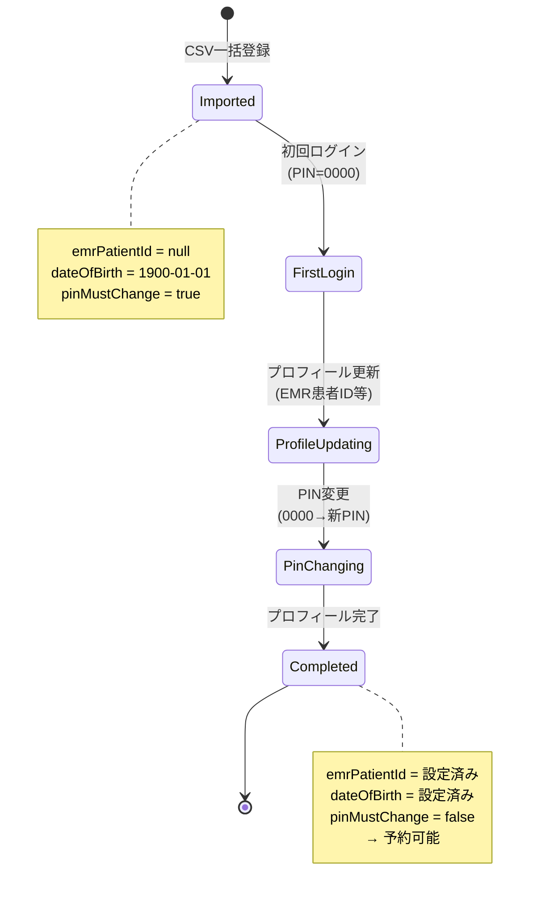
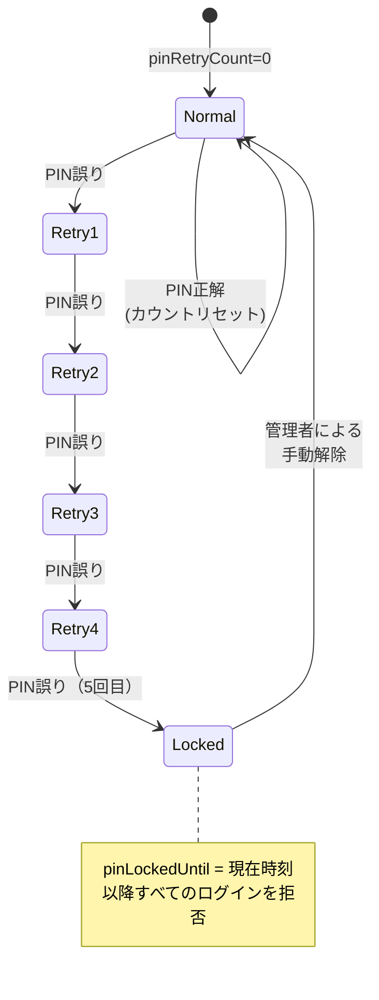
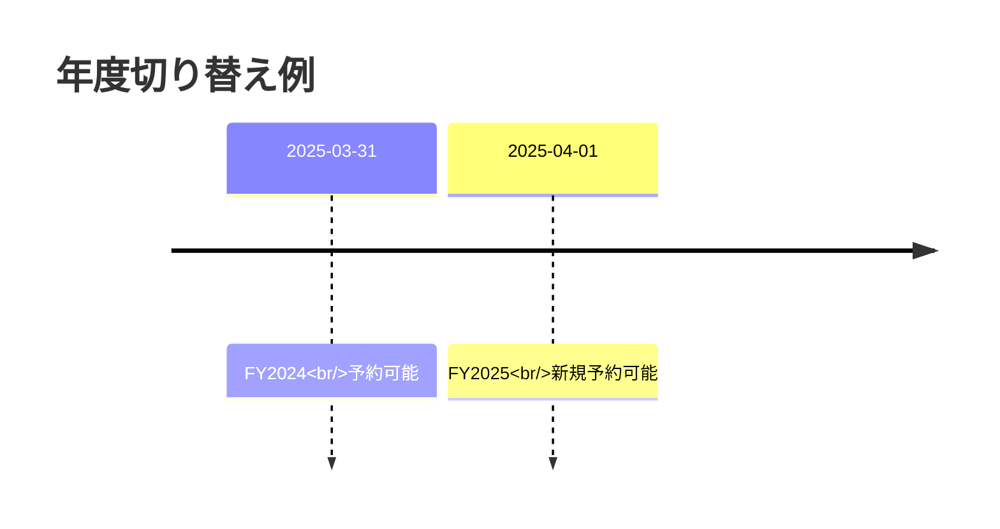
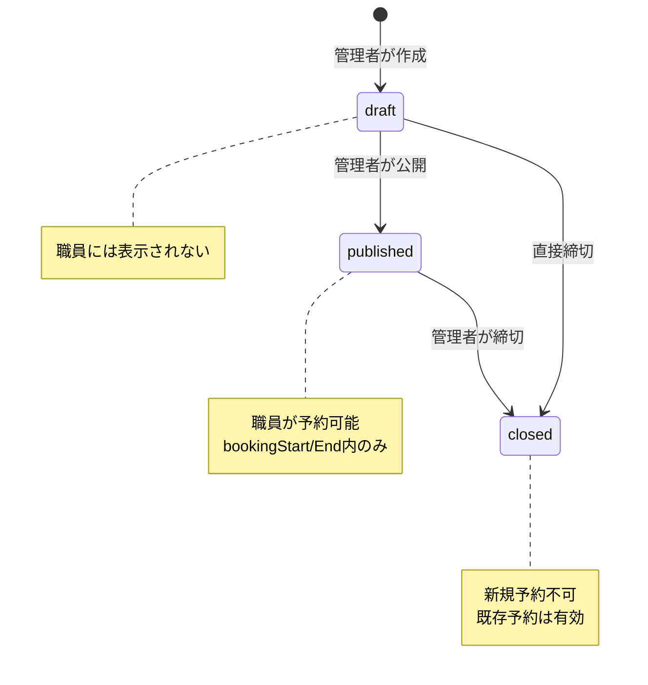

# 13. 業務ルール

## 13.1 概要

このドキュメントでは、予約管理システムの業務ルール・制約条件を定義します。

---

## 13.2 予約制約

### 13.2.1 年度1回制限

**ルール**: 同一職員は、同一年度・同一予約種別の予約を **1回のみ** 実施可能。

#### 年度の定義
- **日本の会計年度**: 4月1日 〜 翌年3月31日
- **例**:
  - FY2025: 2025年4月1日 〜 2026年3月31日
  - FY2026: 2026年4月1日 〜 2027年3月31日

#### 期間キー（Period Key）
年度を識別する文字列。サービス提供日から自動計算。

**計算ロジック**:
```typescript
// src/utils/date.ts
export function calculatePeriodKey(serviceDateLocal: string): string {
  const [year, month] = serviceDateLocal.split('-').map(Number);
  const fiscalYear = month >= 4 ? year : year - 1;
  return `FY${fiscalYear}`;
}
```

**例**:
| サービス提供日 | 期間キー |
|--------------|---------|
| 2025-04-15 | FY2025 |
| 2025-12-01 | FY2025 |
| 2026-03-31 | FY2025 |
| 2026-04-01 | FY2026 |

#### 制約の実装
**データベース制約**:
```sql
UNIQUE (staff_id, reservation_type_id, period_key)
```

**エラー**:
- **409 Conflict**: "Already reserved once in this fiscal year."

---

### 13.2.2 定員管理

**ルール**: 各予約枠には定員があり、定員に達したら新規予約を受け付けない。

#### 定員の管理
- **capacity**: 枠の最大予約数
- **bookedCount**: 現在の予約数
- **条件**: `bookedCount < capacity` の場合のみ予約可能

#### トランザクション制御
```typescript
// src/reservations/reservations.service.ts
await this.dataSource.transaction(async (manager) => {
  // 1. 悲観的ロック（FOR UPDATE）
  const lockedSlot = await slotRepo.findOne({
    where: { id: slotId },
    lock: { mode: 'pessimistic_write' }
  });

  // 2. 定員チェック
  if (lockedSlot.bookedCount >= lockedSlot.capacity) {
    throw new ConflictException('Reservation capacity has been reached.');
  }

  // 3. 予約登録 + カウント更新
  lockedSlot.bookedCount += 1;
  await slotRepo.save(lockedSlot);
  await reservationRepo.save(reservation);
});
```

**エラー**:
- **409 Conflict**: "Reservation capacity has been reached."

---

### 13.2.3 受付期間チェック

**ルール**: 予約枠には受付期間があり、期間外は予約不可。

#### 受付期間の定義
- **bookingStart**: 受付開始日時（null可）
- **bookingEnd**: 受付終了日時（null可）

#### チェックロジック
```typescript
// src/reservations/reservations.service.ts
private isBookingWindowOpen(slot: ReservationSlot): boolean {
  const now = new Date();

  // 1. 枠が公開状態でない
  if (slot.status !== 'published') {
    return false;
  }

  // 2. 受付開始前
  if (slot.bookingStart && now < new Date(slot.bookingStart)) {
    return false;
  }

  // 3. 受付終了後
  if (slot.bookingEnd && now > new Date(slot.bookingEnd)) {
    return false;
  }

  return true;
}
```

**エラー**:
- **403 Forbidden**: "Reservation window closed"

---

### 13.2.4 重複予約防止

**ルール**: 同一職員が同一枠に複数回予約することを防止。

#### データベース制約
```sql
UNIQUE (slot_id, staff_id)
```

**エラー**:
- **409 Conflict**: "Duplicate reservation for this slot."

---

## 13.3 プロフィール完了要件

### 13.3.1 必須項目

予約を行うには、以下の項目が登録済みであること：

| 項目 | フィールド | 初期値 | 必須 |
|------|-----------|--------|------|
| **EMR患者ID** | `emrPatientId` | null | ◯ |
| **生年月日** | `dateOfBirth` | 1900-01-01 | ◯ |
| **性別コード** | `sexCode` | 1 | ◯ |

#### チェックロジック
```typescript
// src/reservations/reservations.service.ts
private ensureStaffEligible(staff: Staff): void {
  // 1. PIN未変更
  if (staff.pinMustChange) {
    throw new HttpException('PIN change required before reserving.', 428);
  }

  // 2. プロフィール未完了
  if (!staff.emrPatientId || !staff.dateOfBirth || !staff.sexCode) {
    throw new HttpException('Profile incomplete for reservation.', 428);
  }
}
```

**エラー**:
- **428 Precondition Required**: "Profile incomplete for reservation."

---

### 13.3.2 プロフィール登録フロー



---

## 13.4 PIN管理

### 13.4.1 初期PIN

**ルール**: 全職員は初期PIN `0000` で登録される。

- **pinMustChange**: `true`（初回ログイン時に変更必須）
- **初回ログイン後**: プロフィール更新 → PIN変更 の順で実施

---

### 13.4.2 PINロック

**ルール**: PIN誤り5回で手動解除が必要になるまでロック。

#### カウント管理
- **pinRetryCount**: 連続失敗回数（0〜5）
- **pinLockedUntil**: ロック解除日時（null = ロックなし）

#### ロックフロー


**エラー**:
- **401 Unauthorized** (1〜4回目): `{ "message": "invalid credentials", "attemptsRemaining": 3 }`
- **423 Locked** (5回目以降): `{ "message": "PIN locked due to repeated failures.", "retryAfter": "2025-11-03T12:00:00Z" }`

---

### 13.4.3 PIN変更

**ルール**: 現在のPINで再認証後、新PINを設定。

#### バリデーション
- **現PIN**: データベースのハッシュと一致すること
- **新PIN**: 数字4桁（例: `1234`）

**エラー**:
- **428 Precondition Required**: "Current PIN is invalid"
- **400 Bad Request**: "PIN must be 4 digits"

---

## 13.5 管理者権限

### 13.5.1 管理者トークン

**ルール**: 管理者APIは固定トークンで認証。

- **環境変数**: `ADMIN_TOKEN`
- **ヘッダー**: `X-Admin-Token`

**エラー**:
- **401 Unauthorized**: "Invalid admin token"

---

### 13.5.2 べき等性キー

**ルール**: 管理者APIは `Idempotency-Key` ヘッダーで重複実行を防止。

#### CSV一括登録の例
```http
POST /api/admin/staffs/import
X-Admin-Token: test-admin-token
Idempotency-Key: import-20251103-001
```

**動作**:
- 同じキーで再実行 → 既存データをスキップ（409を返さない）
- 異なるキー → 新規インポート

---

## 13.6 楽観ロック

### 13.6.1 バージョン管理

**ルール**: 更新時にバージョン番号をチェックし、不一致なら409を返す。

#### 対象エンティティ
- **Staff**: `version` カラム

#### 更新フロー
```typescript
// src/staff/staff.service.ts
async updateProfile(staff: Staff, payload: UpdateProfileDto): Promise<Staff> {
  // 1. バージョンチェック
  if (staff.version !== payload.version) {
    throw new ConflictException('Version mismatch');
  }

  // 2. 更新
  staff.emrPatientId = payload.emrPatientId;
  staff.version += 1;  // バージョンをインクリメント

  return this.staffRepository.save(staff);
}
```

**エラー**:
- **409 Conflict**: "Version mismatch"

---

## 13.7 データ整合性

### 13.7.1 外部キー制約

原則として `ON DELETE RESTRICT` を採用し、例外として枠削除時は割当テーブルが連鎖削除される。

| テーブル | 参照先 | 動作 |
|---------|--------|------|
| **staffs** | departments | 部署削除時、所属職員がいる場合は拒否 |
| **reservations** | staffs | 職員削除時、予約がある場合は拒否 |
| **reservations** | reservation_slots | 枠削除時、予約がある場合は拒否 |
| **reservations** | reservation_types | 種別削除時、予約がある場合は拒否 |
| **reservation_slot_departments** | reservation_slots | 枠削除時に割当も削除 (CASCADE) |
| **reservation_slot_departments** | departments | 割当が存在する部署は削除不可 (RESTRICT) |

---

### 13.7.2 UNIQUE制約

| テーブル | カラム | 制約 |
|---------|--------|------|
| **staffs** | `staff_id` | 職員ID重複不可 |
| **staffs** | `emr_patient_id` | EMR患者ID重複不可（null許可） |
| **reservations** | `(staff_id, reservation_type_id, period_key)` | 年度1回制限 |
| **reservations** | `(slot_id, staff_id)` | 同一枠重複不可 |
| **reservation_slot_departments** | `(slot_id, department_id)` | 同一枠内の部署割当は一意 |

---

### 13.7.3 予約枠部署割当

- 部署がスロットを利用するには、該当する `reservation_slot_departments` レコードが存在し、`enabled=true` であることが必須。
- `capacity_override` が設定されている場合、その部署の予約上限は枠の `capacity` ではなく上書き値で判定する。
- 割当レコードが存在しない部署は予約不可となる（公開済みでも非表示）。

## 13.8 年度切り替え

### 13.8.1 年度境界の処理

**3月31日 23:59 → 4月1日 00:00**



**例**:
- 2025年3月31日の予約 → `periodKey = FY2024`
- 2025年4月1日の予約 → `periodKey = FY2025`
- → 同一職員が両日予約可能（異なる年度）

---

### 13.8.2 複数年度予約

**シナリオ**: 職員Aが「インフルエンザ予防接種」を予約

| 予約日 | サービス提供日 | 期間キー | 予約可否 |
|--------|--------------|---------|---------|
| 2025-04-01 | 2025-10-15 | FY2025 | ✅ 可能 |
| 2025-12-01 | 2026-03-15 | FY2025 | ❌ 不可（既にFY2025で予約済み） |
| 2026-04-01 | 2026-10-15 | FY2026 | ✅ 可能（新年度） |

---

## 13.9 予約枠ステータス

### 13.9.1 ステータス遷移



---

### 13.9.2 ステータス別の動作

| ステータス | 予約可否 | 表示 |
|-----------|---------|------|
| **draft** | ❌ | 非表示 |
| **published** | ✅ (受付期間内) | 表示 |
| **closed** | ❌ | 表示（締切表示） |

---

## 13.10 業務例外

### 13.10.1 予約キャンセル

**現状**: API未実装

**運用回避策**:
1. 管理者がDBから直接削除
2. `canceled_at` を現在時刻に更新

---

### 13.10.2 PIN再発行

**現状**: API未実装

**運用回避策**:
1. 管理者が `pinHash` を初期値に更新
2. `pinMustChange = true` に設定
3. 職員に初回ログイン手順を案内

---

## 13.11 関連ドキュメント

- **[01-Overview.md](./01-Overview.md)** - システム概要
- **[03-Data-Model.md](./03-Data-Model.md)** - データモデル
- **[08-Reservation-API.md](./08-Reservation-API.md)** - 予約API仕様
- **[15-State-Transitions.md](./15-State-Transitions.md)** - 状態遷移図

---

**最終更新**: 2025-11-03
**バージョン**: 1.0.0
